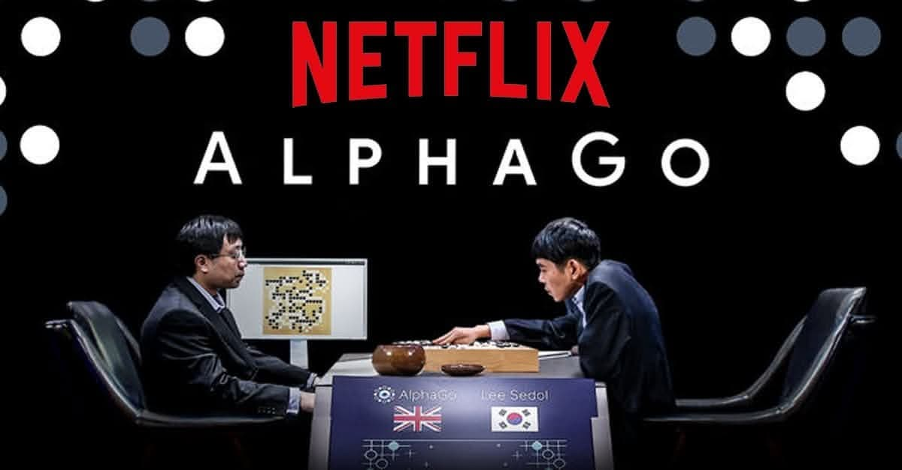
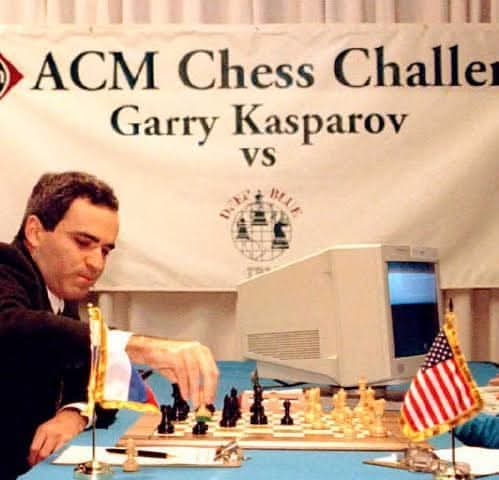
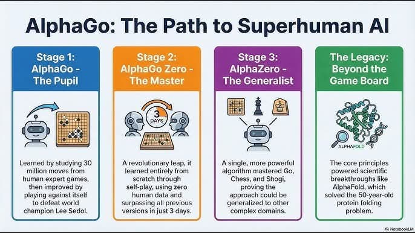
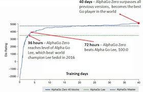
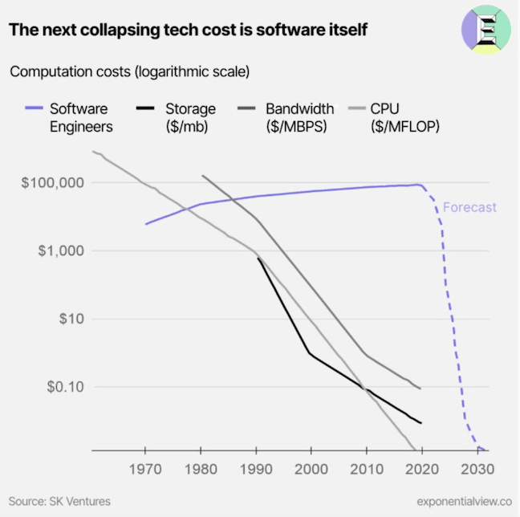

# AlphaGo Stories

---

We know the story of AlphaGo beating Lee Sedol in 2016.

<style>
.columns {
  display: flex;
  gap: 2rem;
  justify-content: center; /* centers horizontally */
  align-items: center;     /* centers vertically */  
}
.column.text {
  flex: 5;
}
.column.image {
  flex: 5;
}
</style>

  <div class="columns">
  <div class="column text">

- After the AlphaGo match, Lee retired from Go three years later

  </div>
  <div class="column image">



</div>
</div>

---

This is pretty much everything we heard about AlphaGo for years:

- However, he retired knowing the human race cannot match AI forever.
- He retired to start the wholly new chapter of his life, where he can find new meaning beyond Go.
- Q: **If you were him, what would your choice knowing that you (the best go player) cannot win against AI?**
- Q: **What is your choice when you know that we (software engineers) cannot win against AI?**

---

It was before the LLM revolution, but it may show us the future of AI impact on development.

- Because what happened to Go players will happen to many professions in the future (and now).
- Because the story of AlphaGo is not just about Go, but about how AI can learn and master complex tasks.

---

<!-- _class: special -->

# Story 1: Why Go Was Considered "Impossible" for AI

---

## Chess vs Go — A Matter of Complexity

IBM's Deep Blue beat chess champion Garry Kasparov in **1997**. So why did it take almost **20 more years** to beat a Go champion?



---

<style scoped>
table {
  font-size: 18pt !important;
}
table thead tr {
  background-color: #aad8e6;
}
</style>

Complexity!

|                       | Chess              | Go                          |
| --------------------- | ------------------ | --------------------------- |
| Board size            | 8 × 8 (64 squares) | 19 × 19 (361 intersections) |
| Possible board states | ~10⁴⁷              | ~10¹⁷⁰                      |
| Avg. moves per turn   | ~35                | ~250                        |
| Game length           | ~80 moves          | ~150 moves                  |

There are more possible Go positions than there are **atoms in the observable universe** (~10⁸⁰). Brute-force search — the approach that worked for chess — was simply impossible.

---

## Deep Blue Could Never Play Go

Deep Blue won at chess by **evaluating millions of positions per second** using hand-crafted rules written by human chess experts.

For Go, this approach fails completely:

- The board is too large to search exhaustively
- Go positions are incredibly hard to evaluate — even experts struggle to say who is winning mid-game
- Go relies on **intuition**, **pattern recognition**, and **long-term strategy** — things that couldn't be captured in simple rules

---

For decades, the best Go programs played at the level of a **weak amateur**. Many AI researchers believed Go would not be solved in their lifetimes.

---

<!-- _class: special -->

# Story 2: The Secret Match — Fan Hui

---

## October 2015 — A Match Nobody Knew About

Before facing Lee Sedol, AlphaGo played a secret match against **Fan Hui**, the European Go champion (2-dan professional).

AlphaGo won **5–0**. A clean sweep.

Fan Hui was devastated. He later described the experience:

---

> "I felt like there was something wrong with my ability to play. I was completely lost."

DeepMind kept the match secret for months while preparing for the bigger challenge — Lee Sedol, a **9-dan professional** and widely considered one of the greatest Go players in history.

---

## Fan Hui's Transformation

After losing, Fan Hui **joined the DeepMind team** as a consultant. He spent months playing against AlphaGo, studying its moves, and **helping the team** understand Go at a deeper level.

Fan Hui later said:

> "AlphaGo helped me to understand Go better. I am a better player now than before I lost."

---

<!-- _class: question -->

### Let's think:

1. What's the human intelligence and machine intelligence? What's the meaning of Fan's being a better player after losing to AlphaGo?
2. What's the meaning of his joining the DeepMind team? Why DeepMind hired him? What does it say about the relationship between human and AI?

---

He went from being **crushed** by AI to becoming one of the first humans to **learn from it**. His world ranking **improved significantly** after training with AlphaGo.

**This may be the most important lesson:** The first human defeated by AI became stronger by embracing (**inviting**) it, not competing against it.

---

<!-- _class: special -->

# Story 3: The Five Games That Shook the World

---

## March 9–15, 2016 — Seoul, South Korea

The match between AlphaGo and Lee Sedol was broadcast live to **over 200 million viewers** worldwide. In Korea, it was front-page news for weeks.

---

<style scoped>
table {
  font-size: 18pt !important;
}
table thead tr {
  background-color: #aad8e6;
}
</style>

**The results:**

|    Game    | Winner        | Notable                                              |
| :--------: | ------------- | ---------------------------------------------------- |
|   Game 1   | AlphaGo       | Lee was confident going in. He was shocked.          |
|   Game 2   | AlphaGo       | AlphaGo played Move 37 — a move no human would make. |
|   Game 3   | AlphaGo       | Lee appeared visibly shaken at the press conference. |
| **Game 4** | **Lee Sedol** | **Lee's "God Move" — Move 78. The crowd erupted.**   |
|   Game 5   | AlphaGo       | Final score: 4–1 for AlphaGo.                        |

---

### Game 2, Move 37 — The Move That Changed Go

In Game 2, AlphaGo placed a stone on a position that **no human player would ever consider**. Professional commentators thought it was a mistake.

**It wasn't.**

Move 37 was placed on the fifth line — in classical Go theory, the fifth line is for building influence, and placing a stone there so early seemed wasteful. Every Go textbook for the past 2,000 years would call it a bad move.

---

### Joseki in Go

Joseki (정석/定石) are established sequences of moves in Go that are considered optimal for both players.

- They are like "openings" in chess, but much more complex due to the larger board and greater number of possibilities.
- Human race had to spend thousands of years to discover one Joseki or another.
- Go players memorize thousands of joseki patterns to play at a high level.

---

But dozens of moves later, it became clear that Move 37 had **set up a devastating strategy** that won the game.

AlphaGo had discovered a move that Professional Go players called it "a move from the future."

- AlphaGo had never been seen before; thousands of years of human Go study had missed.

---

### Game 4, Move 78 — Humanity Strikes Back

By Game 4, Lee Sedol had lost three games. The press was writing his obituary. His body language was defeated.

Then Lee played **Move 78** — a wedge move that professional commentators initially dismissed.

- But it was brilliant. AlphaGo's response was confused. For the first time, AlphaGo began making **clearly bad moves** — it couldn't handle the unexpected situation Lee had created.

---

Lee won Game 4. He said at the press conference:

> "I have never been congratulated so much for winning just one game."

Move 78 was later called **"the most beautiful move ever played in Go"** — because it was a human finding a flaw in the machine.

---

### The Emotional Toll

In 2019, Lee retired from professional Go at age 36. His retirement statement:

> "Even if I become the number one, there is an entity that cannot be defeated."

He is the **only human ever to beat AlphaGo** in a formal match.

---

### Interesting story Lee revealed in 2025:

1. He was confident before the match because he played against the version of AlphaGo that beat Fan Hui, and he won 2 out of 3 games.
2. He was shocked after losing Game 1 because AlpahGo learned really fast and improved quickly.
3. He understood the weak point of AlphaGo in the Game 3, and could won the Game 4.
4. He could possibly win the Game 5 in the same way, but he didn't choose to do so.

---

<!-- _class: special -->

# Story 4: How AlphaGo Actually Worked (Deep Learning + Search)

---

## Two Neural Networks + Search

AlphaGo combined **deep learning** with traditional game-tree **search**:

**1. Policy Network** — "Which move looks promising?"

- **Trained** on 30 million positions from expert human games
- Given a board position, predicts probability of each possible move
- Acts like **intuition** — narrows down from 250 moves to a handful

---

<!-- _class: question -->

### Let's think:

1. Isn't it the same that we can gain intuition from training (learning & experience)? Then, isn't it still important to learn and gain experience in the age of AI?
2. No matter what, isn't it absolutely necessary to learn from human experts in the form of patterns, rules, and strategys?

We understand ourselves (humans) from AI.

---

**2. Value Network** — "Who is winning?"

- Given a board position, **predicts the probability** of winning
- Acts like **judgment** — evaluates how good a position is

---

**3. Monte Carlo Tree Search (MCTS)** — "Let me think ahead"

- Uses both networks to simulate future games
- Explores promising moves deeply, prunes bad ones

---

<!-- _class: question -->

### Let's think:

1. Isn't it the same that judgement has always been the prediction of probability of winning?
2. Isn't it the same that we can think ahead by simulating future in our mind? Can we call it a plan?

We understand ourselves (humans) from AI.

---

## The Key Insight: Intuition + Calculation

```txt
Human Go Master:              AlphaGo:

"This feels right"            Policy Network (deep learning/intuition)
     +                              +
"Let me read ahead"           MCTS + Value Network (calculation)
     =                              =
Expert-level play             Superhuman play
```

- Policy/Value network (Deep Learning) + iMCTS (Search) = Superhuman Go Player

---

AlphaGo didn't replace human intuition with brute force — it **learned** intuition from human games and then **amplified** it with computing power.

- This is fundamentally different from Deep Blue, which used no learning at all.

- AlphaGo was the first demonstration that deep learning could master a task requiring **creativity and strategic thinking**.

---

<!-- _class: special -->

# Story 5: AlphaGo Zero — What If We Remove the Humans?

---

## October 2017 — Starting from Nothing

One year after beating Lee Sedol, DeepMind published an even more shocking result: **AlphaGo Zero**.

**The difference:**

- AlphaGo (2016): Learned from **30 million human games**, then improved by self-play
- AlphaGo Zero (2017): Learned from **zero human games** — purely self-play from random moves

---

AlphaGo Zero was given only the rules of Go. No strategies, no openings, no textbooks. It started by placing stones randomly.

- After **3 days** of training (4.9 million games of self-play), AlphaGo Zero beat the version that defeated Lee Sedol — **100 games to 0**.

---

### The Learning Curve of AlphaGo Zero

<style scoped>
table {
  font-size: 18pt !important;
}
table thead tr {
  background-color: #aad8e6;
}
</style>

In just 40 days of self-play:

| Training Time | Approximate Strength                                  |
| ------------- | ----------------------------------------------------- |
| Hour 0        | Random moves (worse than a child)                     |
| ~3 hours      | Basic patterns emerge                                 |
| ~24 hours     | Amateur-level play                                    |
| ~3 days       | **Beats AlphaGo Lee** (the one that beat Lee Sedol)   |
| ~21 days      | Beats AlphaGo Master (which beat 60 pros online 60–0) |
| ~40 days      | **Strongest Go player in history**                    |

In 40 days, starting from zero knowledge, it surpassed **all of accumulated human Go wisdom**.

---




---

## What AlphaGo Zero Discovered

During training, AlphaGo Zero **independently rediscovered** classic human Go strategies — joseki (정석) that humans developed over thousands of years.

But then it went further. It discovered **entirely new strategies** that humans had never seen.

---

Some human joseki — patterns considered "correct" for centuries — were revealed to be **suboptimal**. AlphaGo Zero found better alternatives.

**Think about what this means:**

- Humans studied Go for **4,000 years**
- An AI, starting from nothing, surpassed all of that in **40 days**
- And it discovered that some of our "wisdom" was actually wrong

---

<!-- _class: question -->

### Let's think:

1. What is **your field's "joseki"** — the established patterns, rules, and best practices that everyone follows?
2. What if an AI came along and found that some of those patterns were actually suboptimal?
3. Are we really sure that our current best practices are the best, or could they be holding us back from discovering better ways of doing things?

---

## AlphaZero — Generalization

<style scoped>
table {
  font-size: 18pt !important;
}
table thead tr {
  background-color: #aad8e6;
}
</style>

DeepMind then asked: **Can the same approach work for other games?**

**AlphaZero** (December 2017) used the exact same algorithm — no human data, pure self-play — for three games:

| Game      | Training Time | Result                                     |
| --------- | ------------- | ------------------------------------------ |
| **Go**    | 34 hours      | Beat AlphaGo Zero                          |
| **Chess** | 9 hours       | Beat Stockfish (world's best chess engine) |
| **Shogi** | 12 hours      | Beat Elmo (world's best shogi engine)      |

---

One algorithm. Three games. Superhuman in all three. No human knowledge required.

**The age of general-purpose AI learning had begun.**

---

<!-- _class: special -->

# Story 6: Beyond Games — AlphaFold

---

## The Protein Folding Problem

DeepMind's ambitions were never just about games. The real goal was to apply these techniques to **scientific problems**.

**The protein folding problem:** Given a protein's amino acid sequence (a string of letters like MVLSPADKTN...), predict its 3D structure.

---

Why it matters:

- Proteins are the machines of life — they do almost everything in your body
- A protein's **shape** determines its **function**
- Predicting shape from sequence had been an unsolved problem for **50 years**
- Understanding protein structures helps us design drugs, fight diseases, and understand biology

---

### 2020 — AlphaFold Solves Protein Folding

At the CASP14 competition (the "Olympics" of protein structure prediction), DeepMind entered **AlphaFold 2**.

- What used to take a PhD student **years** of lab work to determine a single protein structure, AlphaFold could predict in **minutes**.

---

The results stunned the scientific community:

- AlphaFold achieved a median score of **92.4 out of 100** (GDT score)
- The next best team scored around 70
- Scores above 90 are considered **experimentally accurate**
- The competition organizers declared the problem **essentially solved**

---

### AlphaFold's Impact on Science

In 2022, DeepMind released predicted structures for **over 200 million proteins** — nearly every known protein in existence — for free.

**The impact:**

- Researchers worldwide are using it to understand diseases
- Drug companies use it to design new medications
- It has been cited in **thousands of scientific papers**

---

### Two Nobel Prizes in 2024

- Demis Hassabis (DeepMind CEO) and David Baker (University of Washington) won the **2024 Nobel Prize in Chemistry** for his work on protein folding, which was accelerated by AlphaFold's breakthroughs.
- John Hopfield and Geoffrey Hinton won the **2024 Nobel Prize in Physics** for their foundational work on neural networks, which made AlphaGo and AlphaFold possible.

---

## The Journey

Game AI → Go → Self-play → Protein folding → Nobel Prize

- This is the arc from AlphaGo to AlphaFold — from beating humans at games to **helping humans solve real-world problems**.
- This is the victory from "Deep Learning" to "Deep Science" — AI not just playing games, but solving fundamental scientific problems (and beyond).

---

<!-- _class: special -->

# The Bigger Picture

---

## What AlphaGo Teaches Us About AI and Society

The AlphaGo story is playing out again in field after field:

<style scoped>
table {
  font-size: 18pt !important;
}
table thead tr {
  background-color: #aad8e6;
}
</style>

| Domain              | "AlphaGo Moment"                              |
| ------------------- | --------------------------------------------- |
| **Go**              | AlphaGo beats Lee Sedol (2016)                |
| **Protein science** | AlphaFold solves protein folding (2020)       |
| **Art & images**    | DALL-E, Midjourney create stunning art (2022) |
| **Writing & code**  | ChatGPT, Claude, Copilot (2022–)              |
| **Math**            | AlphaGeometry solves olympiad problems (2024) |

The pattern repeats: AI enters a field → surpasses humans → humans must adapt.

**You are living through this transition right now.**

---

## The Impact on Software Engineering

We knew what would happen from the Go industry, now we are seeing it in software engineering:



---

<!-- _class: question -->

### Let's think:

1. What about other jobs? Do we need doctors and laywers in the future?
2. Do we really want AI solve our problems? If so, why? If not why not?
3. The impact of AI is not just about replacing human labor, but also about **augmenting human creativity and problem-solving**. How can we best leverage AI to enhance our work rather than just automate it?

Replaced or Enabled (Enhanced/Augmented)?

---

### The Future of Software Development

1. Coding and programming will be replaced by **prompting and guiding AI** to generate code.
2. The core of software engineering will stay the same: because clients want people to solve their problems, not just write code.

The easy part of software development (writing code) will be automated. The hard part (understanding problems, designing solutions, collaborating with humans) will become even more important.
