# Stories of Deep Learning

**The ideas, the people, and the accidents that built modern AI**

---

Deep learning did not appear out of nowhere.

- It is the result of **70 years** of ideas, failures, rivalries, and comebacks — told through the stories of a handful of stubborn researchers who refused to give up.

These stories will help you understand **why** deep learning works, not just **how**.

---

Deep learning is not magic, it's nothing more than statistics, optimization, and linear algebra.

- But the path to get here was full of surprises.
- Because of three factors, deep learning becomes a magic that can do things we never expected

What are these three factors?

---

DHA

1. Data
2. Hardware
3. Algorithms

Let's talk about the history of deep learning through the lens of these three factors.

---

<!-- _class: special -->

# Story 1: The Perceptron — Born in Hype, Killed by a Book

---

## 1958 — Frank Rosenblatt's Dream

Frank Rosenblatt, a psychologist at Cornell, built a machine called the **Perceptron**.


---

It could learn to classify simple patterns — like telling a triangle from a square.

Rosenblatt made bold claims: this machine would one day "walk, talk, see, write, reproduce itself, and be conscious of its existence."

**The age of thinking machines had begun.**

---

### What is a Perceptron?

A perceptron is the simplest possible neural network — a single "neuron."

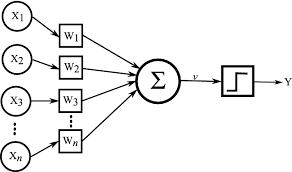

It takes inputs, multiplies each by a weight, sums them up, and if the result exceeds a threshold, it outputs 1 (yes). Otherwise, 0 (no).

---

**The key idea:** The weights are **learned** from data.

- You show it examples, and it adjusts its weights to get better — just like how you learn from practice.
- This is why we need "data" and "algorithms" to make learning machines work.

---

## 1969 — The Book That Nearly Killed AI

Marvin Minsky and Seymour Papert, two MIT professors, published a book called **"Perceptrons."**

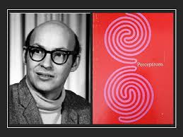

---

They proved mathematically that a single perceptron **cannot learn XOR** — a simple logical function.

<style scoped>
table {
  font-size: 18pt !important;
}
table thead tr {
  background-color: #aad8e6;
}
</style>

| Input A | Input B | XOR Output |
| :-----: | :-----: | :--------: |
|    0    |    0    |     0      |
|    0    |    1    |     1      |
|    1    |    0    |     1      |
|    1    |    1    |     0      |

A perceptron can only draw a **single straight line** to separate classes. XOR is not linearly separable — you need a curve, or more layers.

$x \oplus y = (x \land \lnot y) \lor (\lnot x \land y)$

---

### The First AI Winter

Minsky and Papert's proof was correct, but their **implication** was devastating: they suggested that multi-layer networks would be equally hopeless.

The result:

- **Funding for neural networks dried up almost overnight** -> Researchers abandoned the field
- The US government redirected AI funding toward symbolic AI (rule-based systems)

This period became known as the **first AI winter**

---

Neural networks were considered a dead end. For over a decade, almost nobody worked on them.

**Lesson:** One influential book can change the direction of an entire field — for better or worse.

---

<!-- _class: special -->

# Story 2: Backpropagation — The Idea That Wouldn't Die

---

## The Problem: How Does a Network Learn?

Imagine a neural network with multiple layers. When it makes a wrong prediction, **which weights are to blame?**

```txt
Input → [Layer 1] → [Layer 2] → [Layer 3] → Wrong Output
          w₁₁         w₂₁         w₃₁
          w₁₂         w₂₂         w₃₂
          ...          ...         ...

   Which of these hundreds of weights caused the error?
```

---

This is called the **credit assignment problem** — and for years, nobody had a practical solution.

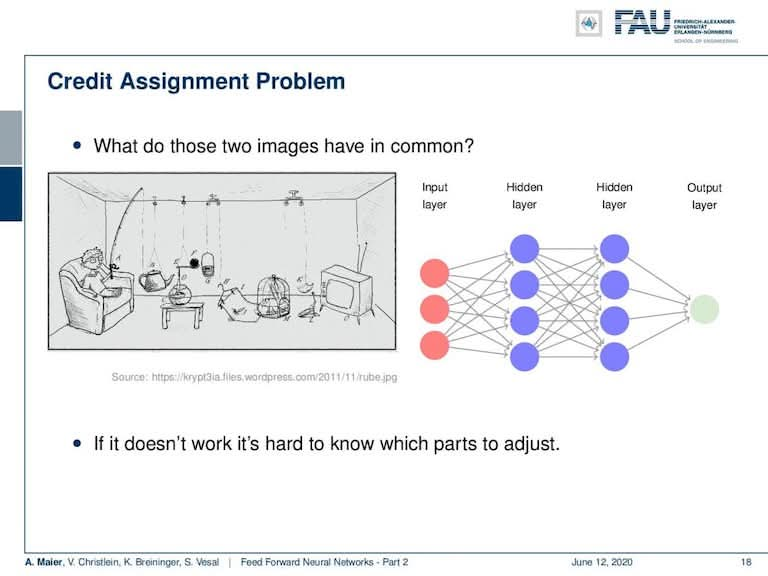

---

## 1986 — Hinton, Rumelhart, and Williams

Geoffrey Hinton, David Rumelhart, and Ronald Williams published the paper that popularized **backpropagation** — a method to efficiently compute how much each weight contributed to the error.


---

**The idea:** Use the chain rule from calculus to propagate the error **backwards** through the network, layer by layer.

$$\frac{\partial L}{\partial w_i} = \frac{\partial L}{\partial y} \cdot \frac{\partial y}{\partial h} \cdot \frac{\partial h}{\partial w_i}$$

---

Start from the output error, and work backwards to figure out how to adjust each weight. This is exactly how every neural network is trained today.

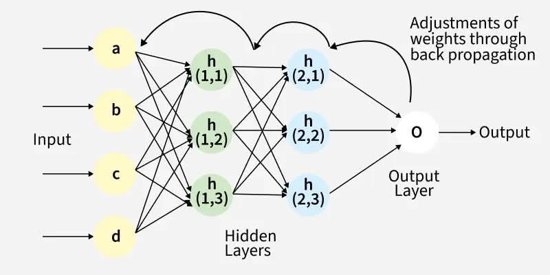

---

### Backpropagation — A Simple Analogy

Imagine a factory assembly line making cars:

```txt
[Part A workshop] → [Part B workshop] → [Assembly] → Defective car!
```

A defective car rolls off the line. How do you find the problem?

---

You **trace backwards**:

1. Is Assembly the problem? Check. Partially — bolts were loose.
2. Is Part B the problem? Check. Yes — parts were slightly too large.
3. Is Part A the problem? Check. A little — material was off-spec.

Now you know **how much to adjust each workshop**. That's backpropagation — tracing the error backwards to assign blame to each stage.

---

### But Nobody Cared... Yet

Backpropagation solved the credit assignment problem. Multi-layer networks could now learn XOR and much more.

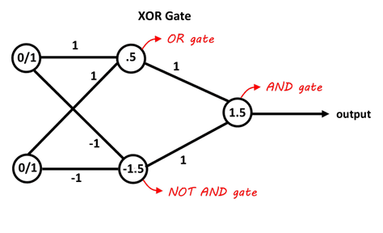

---

**But it still didn't take off.** Why?

- Networks with many layers were **very slow to train** (hours or days on 1980s hardware)

- Simpler methods like **SVMs** (Support Vector Machines) often worked just as well on small datasets

---

### SVM (Support Vector Machine) — The Shiny New Toy

In the 1990s, SVMs became the go-to method for classification tasks. They were faster to train and often more accurate than neural networks on small datasets.

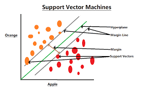

---

### The Problem: Deep Networks Couldn't Learn


- Deep networks suffered from the **vanishing gradient problem** — errors got smaller and smaller as they propagated backwards, so early layers barely learned at all

---

### The Second AI Winter

The AI community moved on to other techniques. Neural networks entered their **second winter**.

Geoffrey Hinton, however, kept believing. He would wait another 20 years.

---

<!-- _class: special -->

# Story 3: The Vanishing Gradient — Deep Learning's Silent Killer

---

## The Vanishing Gradient Problem

Why couldn't early deep networks learn well? The answer lies in how backpropagation works with certain **activation functions**.

The sigmoid function squashes values between 0 and 1:

$$\sigma(x) = \frac{1}{1 + e^{-x}}$$

---

Its maximum gradient (slope) is only **0.25**. During backpropagation, gradients are **multiplied** layer by layer.

For a 10-layer network: $0.25^{10} = 0.00000095$

The gradient reaching the first layer is essentially **zero**. The early layers cannot learn — they are "frozen."

---

## The Fix: ReLU — Beautifully Simple

In 2010–2012, researchers found that replacing sigmoid with **ReLU** (Rectified Linear Unit) dramatically helped:

$$\text{ReLU}(x) = \max(0, x)$$

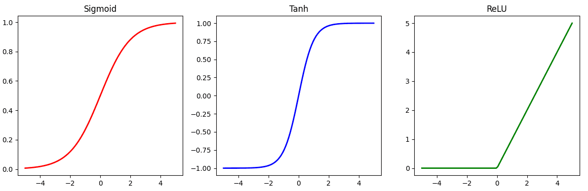

---

ReLU's gradient is either **0 or 1** — no shrinking! Gradients flow back through many layers without vanishing.

**It seems almost too simple to be important.** But this one change — from sigmoid to ReLU — was one of the keys that unlocked deep learning.

---

<!-- _class: special -->

# Story 4: ImageNet and the 2012 Moment

---

## The ImageNet Challenge

In 2009, Fei-Fei Li, a Stanford professor, created **ImageNet** — a dataset of **14 million labeled images** in 20,000+ categories.

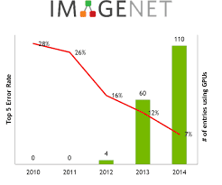

---

She also organized an annual competition: the **ImageNet Large Scale Visual Recognition Challenge (ILSVRC)**. Teams built systems to classify images into 1,000 categories.

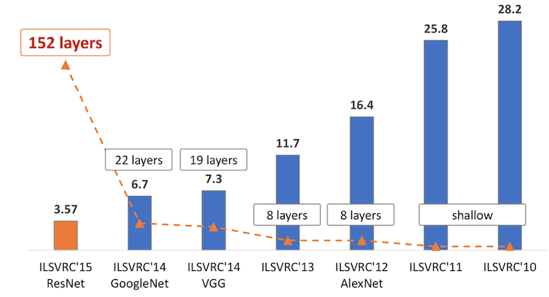

---

<style scoped>
table {
  font-size: 18pt !important;
}
table thead tr {
  background-color: #aad8e6;
}
</style>

Year after year, the best systems used traditional computer vision (hand-crafted features + SVMs). Error rates improved slowly:

| Year | Best Error Rate | Method                |
| :--: | :-------------: | --------------------- |
| 2010 |      28.2%      | Hand-crafted features |
| 2011 |      25.8%      | Hand-crafted features |
| 2012 |     **???**     | ???                   |

---

## 2012 — AlexNet Changes Everything

<style scoped>
table {
  font-size: 18pt !important;
}
table thead tr {
  background-color: #aad8e6;
}
</style>

Geoffrey Hinton's student, **Alex Krizhevsky**, entered the 2012 competition with a deep neural network called **AlexNet**.

|   Year   | Best Error Rate | Method                 |
| :------: | :-------------: | ---------------------- |
|   2010   |      28.2%      | Hand-crafted features  |
|   2011   |      25.8%      | Hand-crafted features  |
| **2012** |    **16.4%**    | **AlexNet (deep CNN)** |

---

AlexNet **crushed** the competition by nearly 10 percentage points. The second-place team had 26.2% error.

- This was not a small improvement. It was a **earthquake**.

---

### What Made AlexNet Work?

<style scoped>
table {
  font-size: 18pt !important;
}
table thead tr {
  background-color: #aad8e6;
}
</style>

AlexNet combined several ideas that, individually, had existed for years:

| Ingredient               | Role                                                   |
| ------------------------ | ------------------------------------------------------ |
| **ReLU activation**      | Solved the vanishing gradient problem                  |
| **GPU training**         | Trained on **two NVIDIA GTX 580 GPUs** — a first       |
| **ImageNet data**        | 1.2 million labeled images — enough data to learn from |
| **Convolutional layers** | Detect visual patterns (edges, textures, shapes)       |
| **Dropout**              | Prevented overfitting by randomly disabling neurons    |

---

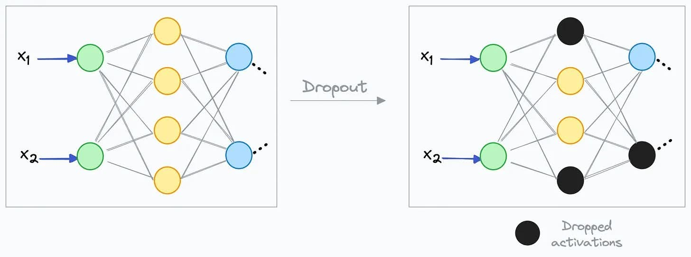
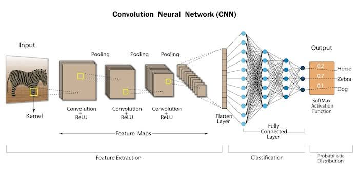

---

No single idea was new.

- But **combining them at scale** produced a result nobody expected.
- This is a recurring theme in deep learning: old ideas + more data + better hardware = breakthroughs.

---

Also, now we see the importance of the three factors (DHA):

- Data: ImageNet provided the data needed to train a deep model.
- Hardware: GPUs made it possible to train large networks in a reasonable time.
- Algorithms: ReLU and dropout were crucial for making deep learning work.

---

### The Aftermath of AlexNet

After 2012, the entire computer vision community **abandoned traditional methods** and switched to deep learning. Within three years:

<style scoped>
table {
  font-size: 18pt !important;
}
table thead tr {
  background-color: #aad8e6;
}
</style>

| Year | Error Rate | Model                   |
| :--: | :--------: | ----------------------- |
| 2012 |   16.4%    | AlexNet (8 layers)      |
| 2014 |    6.7%    | GoogLeNet (22 layers)   |
| 2015 |  **3.6%**  | **ResNet (152 layers)** |

---

**Human-level performance** on ImageNet is roughly 5%. By 2015, deep learning had **surpassed human accuracy**.

The message was clear: **depth matters**, and we were just getting started.

- Also, the GPU that powered AlexNet (GTX 580) is now available for $200 on eBay; The hardware barrier to entry has never been lower.

---

<!-- _class: special -->

# Story 5: ResNet — The Trick That Made Networks _Really_ Deep

---

## The Depth Problem

After AlexNet, everyone tried to build **deeper** networks. More layers should mean more powerful models, right?

But a strange thing happened:

> A 56-layer network performed **worse** than a 20-layer network.

---

This wasn't overfitting (the training error was also worse).

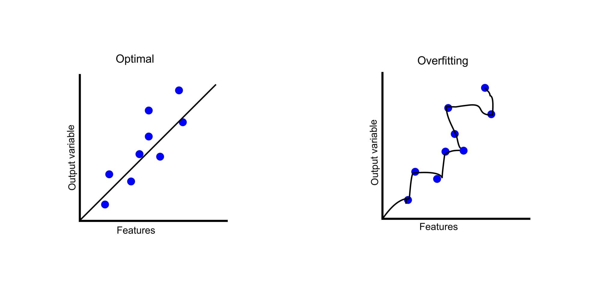

So the model isn’t memorizing too much —
it’s failing to learn at all.

- Deeper networks were somehow **harder to optimize**, even with ReLU.

---

Kaiming He at Microsoft Research asked a simple question: _What if we just let the network learn the **difference** from the input, instead of learning the entire transformation?_


---

### The Residual Connection — Deceptively Simple

$x + F(x) = H(x)$:

If a layer has nothing useful to learn, it can simply learn $F(x) = 0$, and the signal passes through unchanged. The network can **never get worse** by adding more layers.

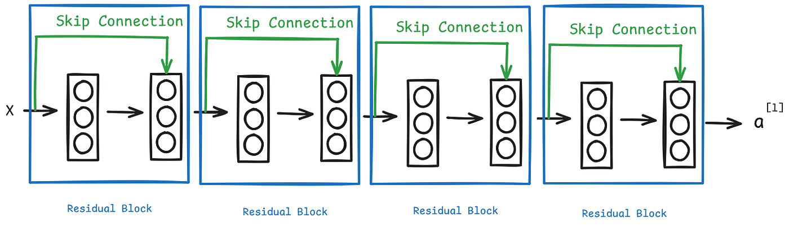

---

### ResNet's Impact

With residual connections, He trained networks with **152 layers** — and even tested one with **1,202 layers**.

**ResNet won the 2015 ImageNet challenge** with 3.6% error, beating humans.

---

But more importantly, the **residual connection** became one of the most important ideas in all of deep learning:

- It is used in **every modern LLM** (GPT, Claude, LLaMA all use residual connections)
- It is used in every modern image model (diffusion models for image generation)
- It solved the fundamental problem of training very deep networks

---

<!-- _class: special -->

# Story 6: Geoffrey Hinton — The Godfather Who Never Gave Up

---

## 30 Years in the Wilderness

Geoffrey Hinton is often called the **"Godfather of Deep Learning."** But his career is also a story about persistence in the face of rejection.

---

**Timeline of Hinton's journey:**

- **1986** — Popularized backpropagation. The world shrugged.
- **1990s** — Neural networks fell out of favor. Funding dried up. Colleagues left.
- **2006** — Published breakthroughs on deep belief networks. A few people noticed.
- **2012** — His student's AlexNet shattered ImageNet. The world finally listened.

---

- **2013** — Google acquired Hinton's startup for $44 million.
- **2018** — Won the **Turing Award** (the "Nobel Prize of computing") alongside Yann LeCun and Yoshua Bengio.
- **2024** — Won the **Nobel Prize in Physics** for foundational AI work.

---

## The Three Who Kept the Faith

<style>
.columns .column {
  font-size: 22px;
}
</style>

Through the AI winters, three researchers refused to abandon neural networks. They are now called the **"Godfathers of Deep Learning"**:

<div class="columns">
<div class="column">

**Geoffrey Hinton**
University of Toronto → Google
Backpropagation, deep belief nets, AlexNet mentor

</div>
<div class="column">

**Yann LeCun**
NYU → Meta (Facebook)
Convolutional Neural Networks (CNNs), handwriting recognition

</div>
<div class="column">

**Yoshua Bengio**
University of Montreal
Sequence modeling, attention, generative models

</div>
</div>

All three won the 2018 Turing Award. Their stubbornness paid off — but only after decades.

---

## Hinton's Warning

In 2023, Hinton **resigned from Google** to speak freely about the dangers of AI.

He said he now partly regrets his life's work:

> The idea that these things could actually get smarter than people — a few people believed that. But most people thought it was way off. And I thought it was way off. I thought it was 30 to 50 years or even longer away. Obviously, I no longer think that.

---

The Godfather who spent his life convincing the world that neural networks could work is now warning the world that they work **too well**.

**This is a remarkable twist** — and something worth thinking about as you build your careers.

---

<!-- _class: special -->

# Story 7: Word2Vec — When Words Became Numbers

---

## The Problem: Computers Don't Understand Words

To a computer, "king" and "queen" are just different strings of characters — no more related than "king" and "pizza."

---

Traditional NLP used **one-hot encoding**:

```txt
"king"  = [1, 0, 0, 0, 0, ...]    (vocabulary size: 50,000+)
"queen" = [0, 1, 0, 0, 0, ...]
"pizza" = [0, 0, 1, 0, 0, ...]
```

In this representation, every word is equally distant from every other word. "King" is just as far from "queen" as it is from "pizza." That's clearly wrong.

---

## 2013 — Tomáš Mikolov's Insight

Tomáš Mikolov at Google published **Word2Vec** — a method to learn dense vector representations of words from large text corpora.

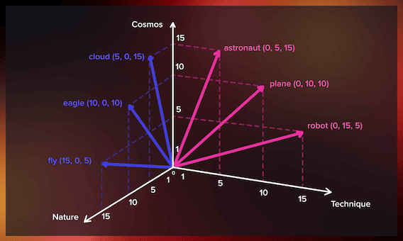

---

The training idea is simple: **predict a word from its neighbors.**

Given: _"The **\_\_\_** sat on the throne"_
The model learns that "king" and "queen" both fit here, so they get **similar vectors**.

The result: words with similar meanings end up **close together** in vector space.

```txt
"king"  = [0.21, 0.83, -0.45, 0.12, ...]
"queen" = [0.19, 0.81, -0.43, 0.15, ...]     ← close!
"pizza" = [0.72, -0.31, 0.55, -0.08, ...]     ← far away
```

---

### The Famous Equation

Word2Vec produced one of the most **surprising results** in all of NLP:

$$\vec{king} - \vec{man} + \vec{woman} \approx \vec{queen}$$

The model had learned, purely from reading text, that the **relationship** between "king" and "man" is the same as the relationship between "queen" and "woman."

---

Other examples that worked:

- $\vec{Paris} - \vec{France} + \vec{Japan} \approx \vec{Tokyo}$
- $\vec{walking} - \vec{walk} + \vec{swim} \approx \vec{swimming}$

**Nobody programmed these relationships.** The model discovered them from patterns in text.

- This was an early hint that meaning could emerge from data alone — a precursor to everything LLMs do today.

---

<!-- _class: special -->

# Story 8: Attention Is All You Need — The Paper That Started the LLM Era

---

## 2017 — Eight Google Researchers

In June 2017, a team of eight researchers at Google published a paper with a bold title: **"Attention Is All You Need."**

They proposed a new architecture called the **Transformer** — and it would become the foundation of GPT, BERT, Claude, LLaMA, and virtually every modern LLM.

**Fun fact:** Most of the eight authors have since left Google to start their own AI companies. The paper created an entire industry.

---

### Processing Sequences — The Old Way

RNNs and LSTMs were the dominant architectures for processing sequences (text, speech, etc.) before the Transformer.


---

### What Problem Did the Transformer Solve?

They processed text **one word at a time**:

```txt
"Students learn deep learning"

 Students → learn → deep → learning
    ↓         ↓       ↓        ↓
   h₁    →   h₂  →   h₃   →    h₄

-To understand "learning", you must wait for h₁, h₂, h₃ first.
```

---

**Two problems:**

1. **Slow** — can't parallelize (each step depends on the previous)
2. **Forgetful** — by the time you reach the end of a long sentence, information about the beginning has faded

---

### The Transformer's Solution: Self-Attention

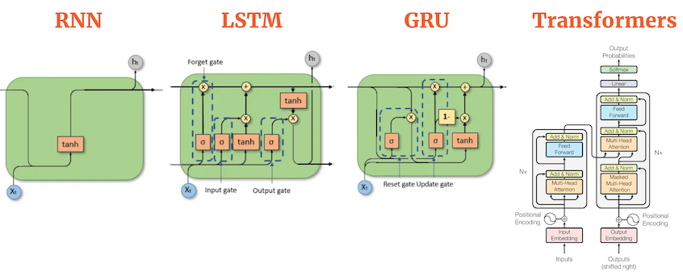

Transformers use a mechanism called **self-attention** to allow every word to directly attend to every other word in the input.

---

The Transformer processes all words **simultaneously**, and lets every word directly attend to every other word:

```txt
"Students learn deep learning"

 Students   learn   deep   learning
    ↕        ↕      ↕       ↕
    ↕        ↕      ↕       ↕
 Every word can "look at" every other word
```

---

To understand "learning," the model can directly look at "deep" and "Students" — no matter how far apart they are.

**Result:** Transformers are massively **parallel** (perfect for GPUs) and can handle **long-range dependencies** easily.

---

## From Transformer to LLM

The Transformer was originally designed for **translation** (English → French). But researchers quickly discovered it could do much more.

**The recipe for modern LLMs turned out to be shockingly simple:**

---

1. Take a **very large** Transformer (billions of parameters)
2. Train it on a **massive** amount of text
3. Give it a simple task: **predict the next word**

> "The capital of France is **_" → "Paris"
> "To be or not to _**" → "be"

---

That's it. Just next-word prediction at enormous scale. And from this simple objective, the model learns grammar, facts, reasoning, coding, humor, and much more.

**This simplicity is what makes LLMs so surprising — and so powerful.**

---

<!-- _class: special -->

# The Big Picture

---

## A Timeline of Key Ideas

<style scoped>
table {
  font-size: 15pt !important;
}
table thead tr {
  background-color: #aad8e6;
}
</style>

| Year         | Idea                 | Why It Matters                                    |
| ------------ | -------------------- | ------------------------------------------------- |
| **1958**     | Perceptron           | First learning machine — showed neurons can learn |
| **1969**     | Minsky's critique    | Killed neural networks for a decade               |
| **1986**     | Backpropagation      | Enabled training of multi-layer networks          |
| **2006**     | Deep belief networks | Hinton revived deep learning                      |
| **2012**     | AlexNet + GPUs       | Proved deep learning works at scale               |
| **2013**     | Word2Vec             | Words as vectors — meaning from data              |
| **2015**     | ResNet               | Residual connections → very deep networks         |
| **2017**     | Transformer          | Attention-based parallel architecture             |
| **2018–now** | GPT, BERT, Claude... | Scale + Transformer = modern AI                   |

---

### Recurring Themes

Always three topics (DHA) in the story: data, hardware, algorithms

Looking at these stories, several themes repeat:

---

**1. Simple ideas win.** ReLU, residual connections, next-word prediction — the most impactful ideas are often embarrassingly simple.

**2. Timing matters more than novelty.** Backpropagation existed before 1986. CNNs existed before 2012. Ideas succeed when data and hardware catch up.

---

**3. Stubbornness pays off.** Hinton, LeCun, and Bengio worked on neural networks when the rest of the world had given up. They were right — but they had to wait 30 years.

**4. Scale reveals surprises.** Word2Vec's analogy arithmetic, GPT's emergent reasoning — these were not designed. They emerged when models got big enough.

---

### This is similar to software engineering story:

1. Simplicity wins (Unix philosophy, microservices)
2. Timing matters (cloud computing + open source made modern software possible)
3. Stubbornness pays off (Linux)
4. Scale reveals surprises (big data + distributed systems enabled new capabilities)

---

## Discussion

1. Which story surprised you the most? Why?

2. The Perceptron was "killed" by a book. Could modern deep learning be similarly disrupted by a theoretical result? Or is the empirical evidence now too strong?

---

3. Hinton spent 30 years on an unpopular idea. Would you have the patience to do the same? What does this say about how research funding should work?

4. LLMs learn from next-word prediction alone — no explicit rules, no grammar lessons. What does this tell us about **how learning works** in general?
