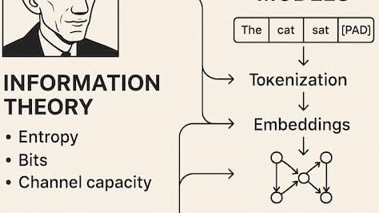
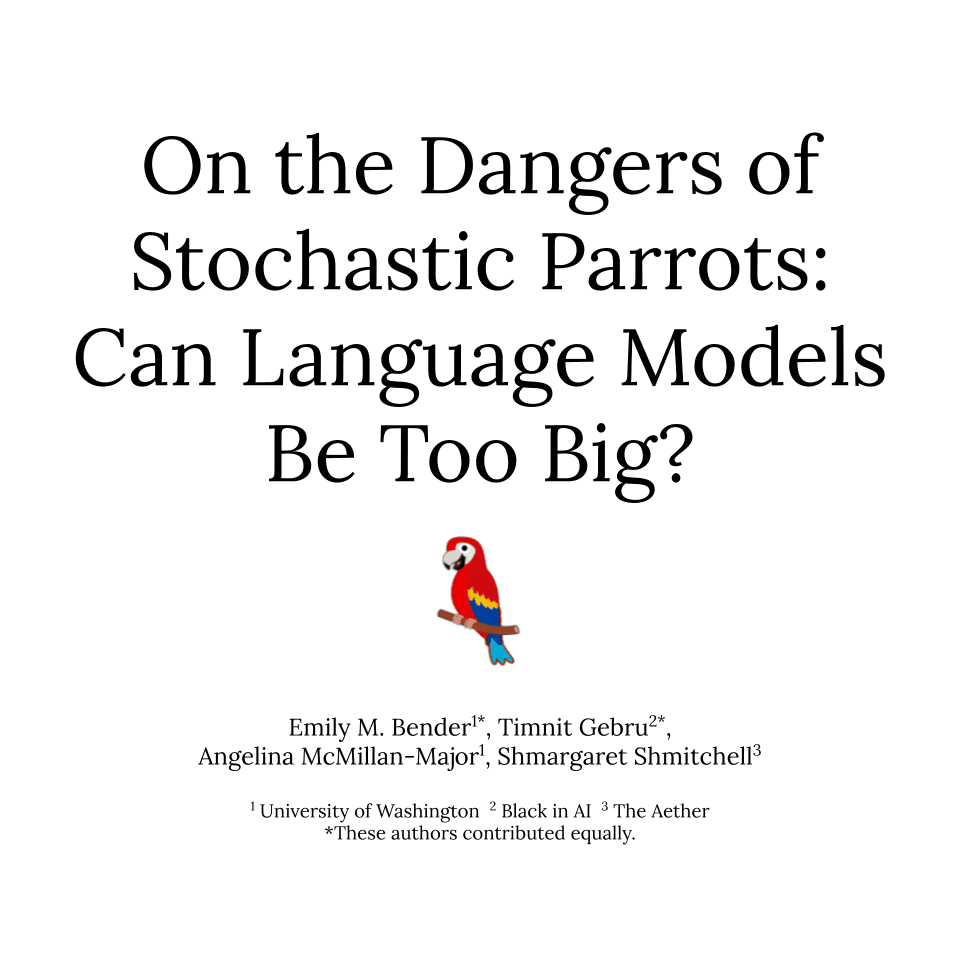
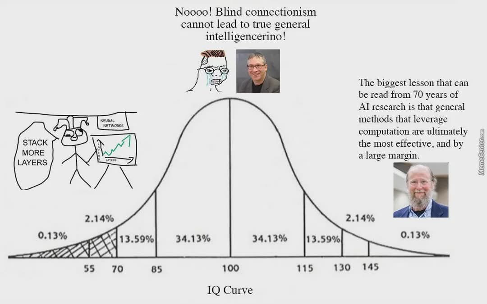

# The Story and Hidden Power of LLMs (Large Language Models)

**How next-word prediction became the most powerful technology of our time**

---

<!-- _class: question -->

**Question: How come LLM is so powerful in making code?**

Related Questions:

- Is LLM really intelligent?
- Then, what is intelligence?

What are your answers?
What are the answers from LLM?
How do you interpret these answers?

---

## Facts

1. LLM is a statistical model trained on vast amounts of text data to understand and generate human-like language.

2. LLMs use deep learning techniques, particularly transformer architectures, to process and generate text.

---

### Interpretation of this fact

1. LLM can just predict the next word based on the previous words, without true understanding of meaning.
2. The transformer algorithm allows LLMs to capture long-range dependencies in text, making them effective for various language tasks.

---

<!-- _class: special -->

# Story 1: The Absurd Simplicity of Next-Word Prediction

---

## The Most Surprising Fact About LLMs

Here is the **entire training objective** of GPT, Claude, LLaMA, and every modern LLM:

> Given a sequence of words, **predict the next word**.

That's it. No grammar rules. No knowledge base. No logic engine. No understanding of the world. Just: _what word comes next?_

---

```txt
"The capital of France is ___"  → "Paris"
"def fibonacci(n):___"         → "\n    if n <= 1:"
"To be or not to ___"          → "be"
```

**Everything** an LLM can do — writing essays, debugging code, explaining quantum physics, translating languages — emerges from this one simple task.

---

### Actually, we do the same

Think about it: to correctly predict the next word in **every possible context**, you need to implicitly learn:

- **Grammar** — to produce syntactically correct sentences
- **Facts** — "The capital of France is \_\_\_" requires knowing geography
- **Logic** — "If A implies B, and A is true, then \_\_\_" requires reasoning

---

- **Code** — "def sort(arr):" requires understanding algorithms
- **Style** — "In Shakespeare's voice:" requires knowing literary style
- **Math** — "2 + 2 = \_\_\_" requires arithmetic

Next-word prediction sounds trivial. But doing it **perfectly well across all of human knowledge** requires something that looks a lot like understanding.

---

## The Shannon Experiment (1951)

This idea is older than you might think. In 1951, Claude Shannon (the father of information theory) ran an experiment:


---

He showed people a passage of text, one letter at a time, and asked them to **guess the next letter**.

He found that people who are better at guessing the next character **understand the language better**. Prediction ability and comprehension are deeply linked.



---

70 years later, we scaled this idea up — from human subjects guessing letters to billion-parameter neural networks predicting tokens across trillions of words.

**Shannon's insight from 1951 is literally the foundation of modern AI.**

---

<!-- _class: special -->

# Story 2: GPT — The Experiment Nobody Expected to Work

---

## 2018: OpenAI's Gamble

In 2018, OpenAI released **GPT-1** (Generative Pre-trained Transformer). The idea was simple but radical:

1. Take a large Transformer
2. Train it to predict the next word on a huge pile of text (pre-training)
3. Then fine-tune it on a specific task (classification, Q&A, etc.)

---

GPT-1 had **117 million parameters** — modest by today's standards. But it showed something remarkable: a model trained on next-word prediction could be fine-tuned to perform well on many different tasks **without being designed for any of them**.

Nobody was sure this would scale. OpenAI decided to find out.

---

## The Scaling Surprise

<style scoped>
table {
  font-size: 18pt !important;
}
table thead tr {
  background-color: #aad8e6;
}
</style>

| Model     | Year | Parameters      | Key Surprise                                         |
| --------- | ---- | --------------- | ---------------------------------------------------- |
| **GPT-1** | 2018 | 117M            | Pre-training + fine-tuning works across tasks        |
| **GPT-2** | 2019 | 1.5B            | Generates coherent multi-paragraph text              |
| **GPT-3** | 2020 | 175B            | Can do tasks it was **never trained for** (few-shot) |
| **GPT-4** | 2023 | ~1.8T (rumored) | Passes the bar exam, writes production code          |

---

Each step was a bet: **"What if we just make it bigger?"**

And each time, the model surprised even its creators. Capabilities emerged that nobody programmed and nobody predicted.

---

### GPT-2: Too Dangerous to Release?

When OpenAI created GPT-2 in 2019, they made a dramatic decision: **they refused to release the full model**, claiming it was "too dangerous."

They were worried it could be used to generate **convincing fake news** at scale. The media went wild. Critics called it a publicity stunt.

---

Looking back, GPT-2's output was decent but clearly imperfect. By today's standards, it reads like a rough draft. But the decision reveals something important: even the people building these systems **didn't know what they had created**. They were surprised by their own model's capabilities.

This pattern — builders being shocked by what their models can do — has repeated with every generation since.

---

<!-- _class: special -->

# Story 3: Emergent Abilities — The Mystery That Divides AI Researchers

---

## What Are Emergent Abilities?

As LLMs get larger, they don't just get gradually better. At certain scales, entirely **new abilities appear suddenly** — capabilities that smaller models completely lack.

```txt
Small model (1B params):    "What is 347 × 28?"  → "9,516" ❌ (wrong)
Medium model (10B params):  "What is 347 × 28?"  → "9,700" ❌ (closer)
Large model (175B+ params): "What is 347 × 28?"  → "9,716" ✅ (correct!)
```

---

It's not that the large model is slightly better at arithmetic — it's that the ability **doesn't exist at all** until the model reaches a certain size, and then it appears seemingly out of nowhere.

---

### Examples of Emergent Abilities

<style scoped>
table {
  font-size: 14pt !important;
}
table thead tr {
  background-color: #aad8e6;
}
</style>

| Ability                        | Appears at ~Scale | Description                                             |
| ------------------------------ | ----------------- | ------------------------------------------------------- |
| **Multi-step arithmetic**      | ~100B params      | Can do multi-digit multiplication                       |
| **Chain-of-thought reasoning** | ~100B params      | Can reason step-by-step when prompted                   |
| **Code generation**            | ~10B+ params      | Can write working programs                              |
| **Analogy making**             | ~50B+ params      | "A is to B as C is to \_\_\_"                           |
| **Translation (zero-shot)**    | ~50B+ params      | Translate between language pairs never seen in training |
| **Theory of mind**             | ~100B+ params     | Can model what another person is thinking               |

None of these abilities were explicitly programmed. They **emerged** from scale.

---

## The Debate: Is Emergence Real?

<style>
.columns .column {
  font-size: 25px;
}
</style>

This is one of the **most heated debates** in AI research right now.

<div class="columns">
<div class="column">

**"Emergence is real"**
(Wei et al., Google, 2022)

- Abilities genuinely appear suddenly at scale
- Suggests there may be even more surprises as models grow
- Implies we don't fully understand what's happening inside

</div>
<div class="column">

**"Emergence is a mirage"**
(Schaeffer et al., Stanford, 2023)

- Appearance of emergence depends on how we measure
- With better metrics, the transition looks gradual
- We may be fooling ourselves with threshold effects

</div>
</div>

---

**Why this matters:** If emergence is real, then building bigger models may unlock capabilities we can't predict today. If it's a mirage, then scaling alone won't lead to AGI.

---

<!-- _class: special -->

# Story 4: The Hidden Power of LLM Reasoning

---

## "LLMs Can't Reason" — The Common Criticism

A common critique of LLMs goes like this:

> "LLMs just pattern-match. They don't truly reason. They're just autocomplete on steroids."

This is **partially true** — LLMs are **statistically** predicting the next token. They don't have a logic engine, a world model, or a planning module.

---

### Experiment: Watch an LLM Think Step by Step

**Without chain-of-thought:**

> Q: "If a store has 15 apples, 3 customers each buy 2, and a delivery of 10 arrives, how many apples are left?"
> A: "20 apples." ❌

---

**With chain-of-thought:**

> Q: Same question. **Think step by step.**
> A: "The store starts with 15 apples. 3 customers each buy 2, so 3 × 2 = 6 are sold. 15 – 6 = 9 remain. A delivery of 10 arrives: 9 + 10 = 19 apples." ✅

---

The model can get the right answer — **but only when asked to show its work.**

Why? Because predicting the tokens "15 – 6 = 9" forces the model to **compute the intermediate result** before continuing. The reasoning happens _in the output text itself_.

---

## The Scratchpad Theory

Here is one of the deepest insights about LLM reasoning:

> **An LLM's output is its "scratchpad." It reasons by writing.**

When a human solves a complex problem, we don't do it all in our heads. We grab a piece of paper, write intermediate steps, and work through the problem.

---

LLMs do the same thing — except their "paper" is the output text. Each generated token becomes part of the context that helps generate the next token.

```txt
Without scratchpad:  Question → Answer (one big jump, often wrong)

With scratchpad:     Question → Step 1 → Step 2 → Step 3 → Answer
                               (each step becomes context for the next)
```

**Chain-of-thought prompting works because it gives the LLM a scratchpad.**

---

## Why This Is More Powerful Than You Think

Consider this: the Transformer architecture performs a **fixed amount of computation** per token. No matter how hard the problem is, each token gets the same compute.

But when the model generates intermediate reasoning steps, it effectively gets **more compute for harder problems** — because harder problems produce longer chains of reasoning, and each step adds new information to the context.

---

```txt
Easy question:   "What is 2 + 3?"
                  → "5" (1 token of computation)

Hard question:   "What is 347 × 28? Think step by step."
                  → "347 × 28. 347 × 20 = 6,940. 347 × 8 = 2,776.
                     6,940 + 2,776 = 9,716." (many tokens of computation)
```

**Longer reasoning chains = more effective compute.** This is why chain-of-thought is so powerful: it transforms a fixed-compute architecture into a variable-compute reasoning system.

---

<!-- _class: special -->

# Story 5: The Reasoning Race — o1, o3, and the New Paradigm

---

## September 2024: OpenAI Releases o1

OpenAI released **o1** (codenamed "Strawberry") — a model that uses chain-of-thought reasoning **internally**, before producing its final answer.

Unlike regular GPT-4, which generates answers immediately, o1 **thinks first**:

---

```txt
Regular GPT-4:    Question → Answer (fast, sometimes wrong)

o1:               Question → [hidden reasoning chain] → Answer
                              (slower, much more accurate)
```

On the AIME math competition (designed for top high school students), **o1 scored 83%** — up from GPT-4's 13%. On competitive programming, it reached the 89th percentile on Codeforces.

**The implication:** We found a new "axis" of improvement beyond just making models bigger.

---

### Revolution!

This is about the time we observe the **REVOLUTION** in LLMs — the shift from "scale up" to "think longer".

- The idea that you can get better answers not just by making the model bigger, but by letting it reason more deeply at inference time.

---

### The Two Axes of LLM Improvement

Before o1, there was essentially one way to make LLMs better: **scale up** (more parameters, more data).

Now there are **two axes**:

<div class="columns">
<div class="column">

**Axis 1: Training-time compute**
Make the model bigger/better.
(GPT-3 → GPT-4)

More knowledge, better patterns.

</div>
<div class="column">

**Axis 2: Inference-time compute**
Let the model think longer.
(GPT-4 → o1)

More reasoning, better answers.

</div>
</div>

---

Think of it this way: Axis 1 is like **studying more for an exam** (learning). Axis 2 is like **taking more time on each exam question** (thinking).

Both improve performance, but in different ways.

---

## Inference-Time Scaling — A New Paradigm

<style scoped>
table {
  font-size: 18pt !important;
}
table thead tr {
  background-color: #aad8e6;
}
</style>

The "inference-time scaling" insight is that **you can trade compute for accuracy at answer time**:

| More thinking time                   | Better answers       |
| ------------------------------------ | -------------------- |
| Generate 1 reasoning chain           | Baseline accuracy    |
| Generate 10 chains, pick the best    | Significantly better |
| Generate 100 chains, verify each     | Even better          |
| Let the model self-correct and retry | Better still         |

---

### Same Model, Different Quality Answers

This means that the same model can give **different quality answers** depending on how much time (and compute) you allow it.

A harder question? Give it more time to think. A simple question? Answer immediately.

**This is exactly how humans work.** We don't think equally hard about every question.

---

<!-- _class: special -->

# Story 6: The "Stochastic Parrot" Debate

---

## Are LLMs Just Sophisticated Parrots?

In 2021, researchers Emily Bender and Timnit Gebru published a provocative paper calling LLMs **"Stochastic Parrots"**:

> A language model is "a system for haphazardly stitching together sequences of linguistic forms... without any reference to meaning."

---

In other words: LLMs don't **understand** anything. They just remix patterns from their training data in statistically plausible ways. Like a parrot that mimics speech without understanding it.

**This paper ignited one of the biggest debates in AI.**



---

## The Case For "Just a Parrot"

Evidence that LLMs don't truly understand:

- **Fragile reasoning:** Change a math problem slightly and the LLM fails, while a human who truly understands the concept adapts easily
- **Hallucinations:** LLMs confidently state false things — a being that "understands" would know when it doesn't know
- **No world model:** LLMs can describe how gravity works but can't actually simulate a ball falling

---

- **Sensitivity to phrasing:** The same question worded differently can produce different answers

```txt
"What is 27 × 43?"                 → Correct ✅
"What is 27 × 43, but start
 by computing 43 × 27 instead?"    → Sometimes confused 🤔
```

---

### The Case Against "Just a Parrot"

Evidence that something deeper is happening:

- **Novel combinations:** LLMs can combine concepts in ways never seen in training data — this is more than memorization
- **Transfer learning:** A model trained on text can solve math, write code, and pass medical exams — parrots can't do that

---

- **Internal representations:** Research shows LLMs form internal models of concepts like spatial relationships, time, and even truth vs falsehood
- **Emergent abilities:** Capabilities appear at scale that no one programmed — pure pattern matching can't explain this

In 2023, researchers at MIT found evidence that LLMs build **linear representations of truth** — they have an internal sense of whether a statement is true or false, separate from their training data.

---

### The Real Answer: It's Complicated

The most honest answer is somewhere in between:

> LLMs don't reason the way humans do. But they do something more than memorization. What exactly that "something" is — we don't fully understand yet.

---

## The practical takeaway for software engineers

- Don't assume LLMs "understand" — always verify critical outputs
- Don't dismiss LLMs as "just autocomplete" — they can genuinely solve novel problems
- Treat them as a **powerful but unreliable reasoning partner** — like a very smart colleague who sometimes confidently makes things up

---

<!-- _class: special -->

# Story 7: The Knowledge Hidden Inside LLMs

---

## LLMs Know More Than They Should

Here's something strange: LLMs sometimes demonstrate knowledge that seems impossible to learn from next-word prediction alone.

**Example 1 — Spatial reasoning:**

> "If I'm facing north and turn right twice, which direction am I facing?"
> LLM: "South."

---

**Example 2 — Causal reasoning:**

> "A glass fell off a table and hit a soft pillow. Did it break?"
> LLM: "Probably not — the pillow would cushion the impact."

**Example 3 — Emotional intelligence:**

> "My coworker keeps taking credit for my work. How should I handle this?"
> LLM: Gives nuanced, situationally-aware advice.

---

These tasks require something beyond pattern matching.

- The model seems to have built **implicit models** of physics, social dynamics, and spatial relationships — all from just reading text.

---

## The World Model Hypothesis

Some researchers believe LLMs are building **compressed world models** inside their neural networks.

The argument: To predict the next word accurately across all types of text — science textbooks, fiction, code, conversations — the model must learn **something** about how the world actually works.

---

```txt
To predict text about physics   → must learn a model of physics
To predict text about code      → must learn a model of computation
To predict text about people    → must learn a model of human behavior
To predict text about geography → must learn a model of spatial relations
```

These models are imperfect and implicit — the LLM can't draw a diagram of gravity. But they are **real enough to produce correct answers** in many cases.

**The question is: how far can implicit world models go?**

---

<!-- _class: special -->

# Story 8: The Bitter Lesson — Why Simple + Scale Wins

---

## Richard Sutton's "The Bitter Lesson" (2019)

AI researcher Richard Sutton wrote one of the most influential blog posts in AI history, called **"The Bitter Lesson."**



---

His argument:

> The biggest lesson from 70 years of AI research is that **general methods that leverage computation are ultimately the most effective** — and by a large margin.

---

### What does this mean?

Researchers kept trying to build clever, hand-crafted systems that encoded human knowledge (expert systems, rule-based NLP, feature engineering).

- And they kept being beaten by simple methods + more compute + more data.

---

## The Bitter Lesson in Action

<style scoped>
table {
  font-size: 14pt !important;
}
table thead tr {
  background-color: #aad8e6;
}
</style>

| Domain          | "Smart" approach (lost)           | "Simple + scale" approach (won)        |
| --------------- | --------------------------------- | -------------------------------------- |
| **Chess**       | Hand-crafted evaluation (1990s)   | Deep search + neural nets (AlphaZero)  |
| **Vision**      | Hand-crafted features (SIFT, HOG) | CNNs trained on data (AlexNet)         |
| **Translation** | Rule-based / statistical MT       | Seq2seq neural networks                |
| **NLP**         | Parse trees + ontologies          | LLMs (just predict the next word)      |
| **Go**          | Expert rules + search             | Neural nets + self-play (AlphaGo)      |
| **Code**        | Formal verification + rules       | LLMs trained on code (Copilot, Claude) |

**The pattern:** Simple learning + massive scale beats clever engineering, every time.

---

### Why This Lesson Is "Bitter"

It's called "bitter" because:

- Researchers spend **years** building elegant, domain-specific solutions
- Then someone comes along with a **simple but scaled** approach and beats them
- All that domain expertise and clever engineering becomes obsolete

---

For LLMs specifically: decades of work in computational linguistics — parse trees, grammar rules, semantic ontologies — were largely replaced by a single idea: **predict the next word, but do it at massive scale**.

**This is bitter for the experts.** But it's also **profound**: it suggests that the path to more powerful AI may be simpler than we think.
