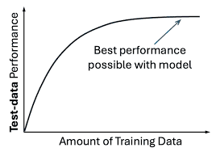
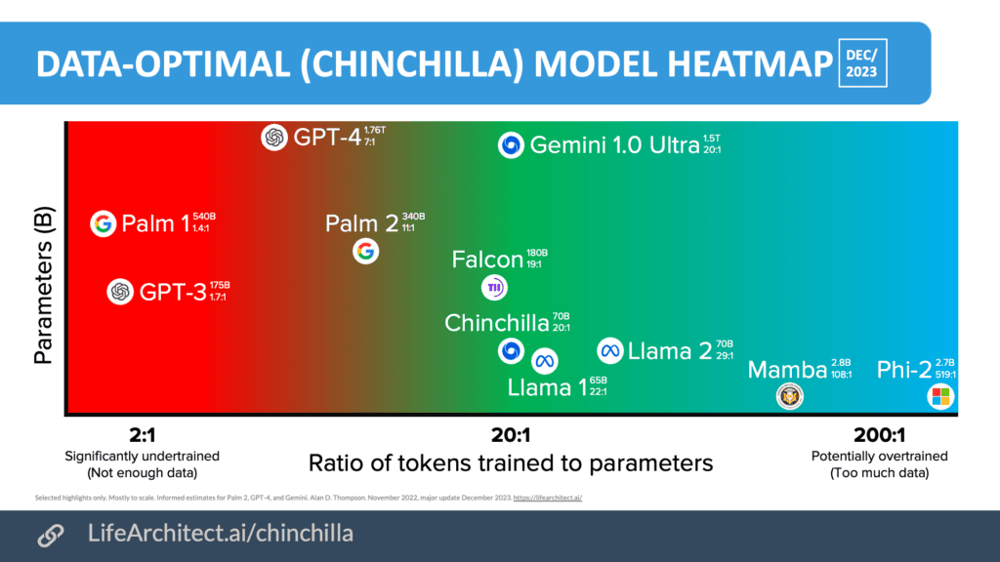
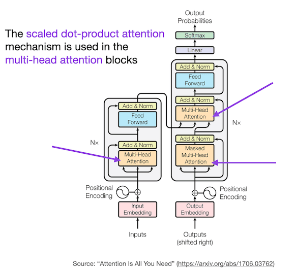
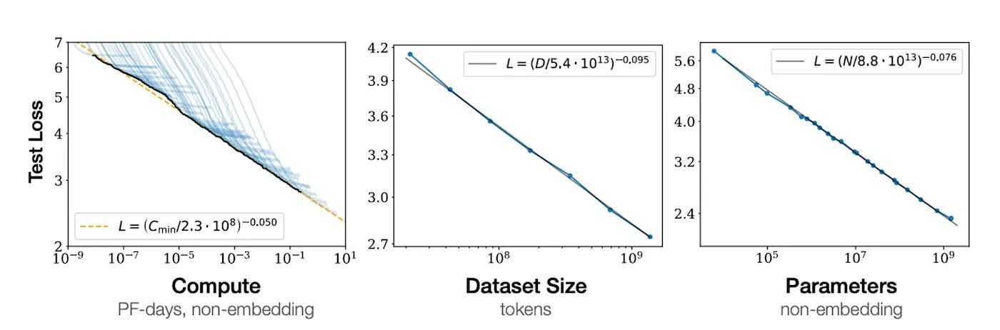

# The Three Pillars of LLM Success

**Data, Algorithms, and Hardware**

---

## Why Did LLMs Succeed _Now_?

The ideas behind neural networks have existed since the 1950s.

- So why did LLMs like GPT and Claude only become possible in recent years?

---

<style>
.columns .column {
  font-size: 25px;
}
</style>

Because **three factors** finally converged at the same time: DHA — Data, Hardware, and Algorithms.

<div class="columns">
<div class="column">

**Data**
Massive text from the internet

</div>
<div class="column">

**Hardware**
GPUs powerful enough to train on it all

</div>
<div class="column">

**Algorithms**
The Transformer architecture (2017)

</div>
</div>

Remove any one of these, and modern LLMs would not exist.

---

## The Three Pillars — An Analogy

Think of building a skyscraper:

<style scoped>
table {
  font-size: 18pt !important;
}
table thead tr {
  background-color: #aad8e6;
}
</style>

| Pillar         | Skyscraper Analogy                      | LLM Equivalent                            |
| -------------- | --------------------------------------- | ----------------------------------------- |
| **Data**       | Raw materials (steel, concrete, glass)  | Trillions of tokens from books, web, code |
| **Hardware**   | Construction equipment (cranes, trucks) | GPUs, TPUs, large compute clusters        |
| **Algorithms** | Architectural blueprint                 | Transformer, attention mechanism          |

You can have the best blueprint in the world, but without materials and equipment, nothing gets built. The same is true for LLMs.

---

<!-- _class: special -->

# Pillar 1: Data

---

## Data — The Fuel for LLMs

LLMs learn language by reading **enormous amounts of text**. The quality, quantity, and diversity of data determine how capable the model becomes.

**GPT-3 (2020):** trained on ~300 billion tokens
**LLaMA 2 (2023):** trained on ~2 trillion tokens
**LLaMA 3 (2024):** trained on ~15 trillion tokens

For reference: 1 trillion tokens ≈ roughly 750 billion words — that is approximately **7.5 million copies** of the entire Harry Potter series.

---

## Where Does the Training Data Come From?

| Source               | Examples                               | What the LLM Learns            |
| -------------------- | -------------------------------------- | ------------------------------ |
| **Web pages**        | Common Crawl, Wikipedia                | General knowledge, facts       |
| **Books**            | Project Gutenberg, digitized libraries | Long-form reasoning, narrative |
| **Code**             | GitHub, Stack Overflow                 | Programming languages, logic   |
| **Academic papers**  | arXiv, PubMed                          | Scientific reasoning           |
| **Conversations**    | Reddit, forums                         | Dialogue, Q&A patterns         |
| **Curated datasets** | MMLU, HumanEval                        | Benchmarking, evaluation       |

Modern LLMs use a **carefully curated mix** — not just raw internet dumps.

---

## Data Quality Matters More Than Quantity

Simply having _more_ data is not enough. The training pipeline involves extensive **data cleaning**:

1. **Deduplication** — Remove duplicate web pages and repeated content
2. **Filtering** — Remove low-quality, toxic, or spam content

---

3. **Language identification** — Separate English from other languages
4. **Domain balancing** — Ensure a healthy mix (code, science, conversation...)
5. **PII removal** — Strip personal information (emails, phone numbers)

**Lesson:** Garbage in → garbage out. A model trained on low-quality data produces low-quality outputs, no matter how big it is.

---

## The Data Scaling Law

Research from OpenAI (Kaplan et al., 2020) showed a **power-law relationship**:

> As you increase the amount of training data, the model's performance improves **predictably** — following a smooth curve.



---

**Key insight from the Chinchilla paper** (DeepMind, 2022):

**Tokens** (data) and **parameters** (model size) must be scaled together for optimal performance.



---

**Tokens**

- Smallest text units the model reads
- Words, subwords, or symbols

Example:

"Students learning AI"

→ ["Student", "s", "learning", "AI"]

**Role:** Training data

---

**Parameters**

- Learnable numbers inside the model
- Weights in Attention, FFN, Embeddings

Example:

```tt
W =
[ 0.2 -1.1 0.7 0.3
-0.8 0.1 0.6 -0.2 ]
```

**Role:** Knowledge storage

Learning = Adjusting parameters to minimize loss on training data

---

**Intuition**

- Tokens = Books
- Parameters = Brain capacity

More books fill the brain.  
Big brain + few books → undertrained.

**Question**

How much data (token) is enough per parameter? how many tokens do we need?

5? 10? 100? Is more always better?

---

- Most early LLMs were **undertrained** — they had too many parameters for the amount of data
- The optimal ratio: **~20 tokens per parameter**
- A 70B parameter model needs ~1.4 trillion tokens to be optimally trained

This shifted the industry from "bigger models" to "**more and better data**."

---

## The Data Wall Problem

The AI industry is approaching a **data wall**:

- High-quality text on the internet is **finite**
- Some estimates suggest we will exhaust publicly available quality text by 2026–2028

---

**Current strategies to overcome this:**

- **Synthetic data** — use LLMs to generate training data for other LLMs
- **Data augmentation** — rephrase, translate, or restructure existing data

---

- **Multimodal data** — incorporate images, video, and audio
- **Proprietary data** — partnerships with publishers, news organizations
- **Curriculum learning** — train on easy data first, then harder data

This is one of the most active areas of AI research today.

---

<!-- _class: special -->

# Pillar 2: Hardware

---

## Why Hardware Matters

Training an LLM is an **extraordinarily compute-intensive** task.

**GPT-3 training (2020):**

- ~3,640 petaflop-days of compute
- Estimated cost: **$4.6 million** in GPU time

---

**GPT-4 training (2023):**

- Estimated cost: **$100+ million**

**LLaMA 3 405B (2024):**

- Trained on **16,384 NVIDIA H100 GPUs** for ~54 days
- Estimated cost: **$200+ million**

Without modern GPU/TPU hardware, training these models would take **centuries** on traditional CPUs.

---

### CPU vs GPU — Why GPUs?

<style>
.columns .column {
  font-size: 25px;
}
</style>

<div class="columns">
<div class="column">

### CPU

- Few powerful cores (8–64)
- Great for **sequential** tasks
- General purpose
- Analogy: A **few expert chefs** cooking one dish at a time

</div>
<div class="column">

### GPU

- Thousands of smaller cores (10,000+)
- Great for **parallel** tasks
- Optimized for matrix math
- Analogy: **Thousands of cooks** each doing one simple step simultaneously

</div>
</div>

LLM training is **matrix multiplication at massive scale** — exactly what GPUs excel at.

---

## The NVIDIA Dominance

<style scoped>
table {
  font-size: 13pt !important;
}
table thead tr {
  background-color: #aad8e6;
}
</style>

NVIDIA GPUs have become the backbone of AI training:

| GPU      | Year | Memory | AI Performance      |
| -------- | ---- | ------ | ------------------- |
| **V100** | 2017 | 32 GB  | 125 TFLOPS (FP16)   |
| **A100** | 2020 | 80 GB  | 312 TFLOPS (FP16)   |
| **H100** | 2022 | 80 GB  | 990 TFLOPS (FP16)   |
| **H200** | 2024 | 141 GB | 990 TFLOPS (FP16)   |
| **B200** | 2024 | 192 GB | 2,250 TFLOPS (FP16) |

**Key insight:** Each generation roughly **3× the performance** of the previous one. This exponential improvement in hardware has directly enabled exponential growth in model size.

---

## Beyond GPUs — Other AI Hardware

<style scoped>
table {
  font-size: 18pt !important;
}
table thead tr {
  background-color: #aad8e6;
}
</style>

| Hardware                         | Company         | Key Feature                                  |
| -------------------------------- | --------------- | -------------------------------------------- |
| **TPU** (Tensor Processing Unit) | Google          | Custom-designed for TensorFlow/JAX workloads |
| **Trainium / Inferentia**        | AWS             | Cost-optimized for training and inference    |
| **Gaudi**                        | Intel/Habana    | Alternative to NVIDIA for training           |
| **Groq LPU**                     | Groq            | Extremely fast inference (low latency)       |
| **Apple Neural Engine**          | Apple           | On-device AI in iPhones/Macs                 |
| **Custom ASICs**                 | Meta, Microsoft | Purpose-built chips for internal workloads   |

The hardware race is one of the biggest battlegrounds in AI today.

---

## The Memory Problem

A major hardware bottleneck is **GPU memory (VRAM)**.

A model with 70 billion parameters:

- At FP32 (32-bit): needs **280 GB** just to store weights
- At FP16 (16-bit): needs **140 GB**
- At INT8 (8-bit quantized): needs **70 GB**
- At INT4 (4-bit quantized): needs **35 GB**

---

A single H100 GPU has only 80 GB of memory. Training requires additional memory for gradients and optimizer states (often 3–4× the model size).

**Solution:** Distribute across **many GPUs** using parallelism strategies (data parallel, tensor parallel, pipeline parallel).

---

## Inference vs Training Hardware

Training and inference have **different** hardware requirements:

<style scoped>
table {
  font-size: 13pt !important;
}
table thead tr {
  background-color: #aad8e6;
}
</style>

| Aspect          | Training                | Inference                     |
| --------------- | ----------------------- | ----------------------------- |
| **Goal**        | Learn model weights     | Generate responses            |
| **Compute**     | Extremely high          | Moderate                      |
| **Duration**    | Weeks to months         | Milliseconds to seconds       |
| **GPUs needed** | Thousands               | One to a few                  |
| **Cost focus**  | Total training cost     | Cost per token/query          |
| **Key metric**  | Throughput (tokens/sec) | Latency (time to first token) |

**This is why you can run LLMs on your laptop** (inference) but cannot train one at home (training).

---

## Quantization — Making LLMs Run on Consumer Hardware

**Quantization** reduces the precision of model weights to use less memory:

```txt
Original (FP16):  0.23456789... → stored in 16 bits
Quantized (INT4): 0.23456789... → mapped to nearest of 16 values
                                   stored in just 4 bits
```

---

<style scoped>
table {
  font-size: 18pt !important;
}
table thead tr {
  background-color: #aad8e6;
}
</style>

| Precision | Bits per Weight | 70B Model Size | Quality                 |
| --------- | --------------- | -------------- | ----------------------- |
| FP16      | 16              | ~140 GB        | Full quality            |
| INT8      | 8               | ~70 GB         | Near-full quality       |
| INT4 (Q4) | 4               | ~35 GB         | Good quality, some loss |
| INT2      | 2               | ~17.5 GB       | Noticeable degradation  |

**Tools like llama.cpp and Ollama** use quantization to let you run LLaMA 70B on a desktop with a 48 GB GPU or even a Mac with 64 GB RAM.

---

<!-- _class: special -->

# Pillar 3: Algorithms

---

## The Key Breakthrough: The Transformer

Before 2017, the dominant models for language were **RNNs** (Recurrent Neural Networks) and **LSTMs**. They processed text **one word at a time**, left to right.

**The problem:** They were slow and struggled with long-range dependencies.

---

In 2017, Google published **"Attention Is All You Need"** — introducing the **Transformer** architecture.

**The key idea:** Process all words in a sentence **simultaneously** using a mechanism called **self-attention**.

---

## RNN vs Transformer — Visual Comparison

<style>
.columns .column {
  font-size: 25px;
}
</style>

<div class="columns">
<div class="column">

### RNN (Sequential)

```txt
"The cat sat on the mat"

The → cat → sat → on → the → mat
 ↓    ↓     ↓    ↓     ↓     ↓
h₁  → h₂  → h₃ → h₄ → h₅  → h₆
```

Each word must wait for the previous one.
**Slow, hard to parallelize.**

</div>
<div class="column">

### Transformer (Parallel)

```txt
"The cat sat on the mat"

The  cat  sat  on  the  mat
 ↕    ↕    ↕    ↕    ↕    ↕
 All words attend to all
 other words simultaneously
```

All words processed at once.
**Fast, highly parallelizable.**

</div>
</div>

---

## Self-Attention — The Core Idea

**Self-attention** lets each word "look at" every other word in the sentence to understand context.

Example: _"The **bank** of the river was covered in mud."_

---

For the word "bank," self-attention computes:

- How relevant is "river"? → **Very high** (helps disambiguate meaning)
- How relevant is "mud"? → **High** (confirms "river bank" meaning)
- How relevant is "The"? → **Low**

This allows the model to understand that "bank" means **riverbank**, not a financial institution — by attending to context words.

---

## Self-Attention — Simplified Math

**Imagine a classroom**

Every word is a kid in the classroom.

- They want to talk to each other to understand the sentence.
- But before talking, each kid makes 3 cards.

---

### QKV — The Three Vectors

For each word, the model computes three vectors:

- **Q** (Query): "What am I looking for?"
- **K** (Key): "What do I contain?"
- **V** (Value): "What information do I provide?"

---

$$\text{Attention}(Q, K, V) = \text{softmax}\left(\frac{QK^T}{\sqrt{d_k}}\right)V$$

In plain English:

1. Compare each word's Query with every other word's Key → get similarity scores
2. Normalize with softmax → turn scores into weights (probabilities)
3. Multiply weights by Values → get the context-aware representation

---

In short, each word (student) decides what other words (students) are worthy of **attention** based on how well their Q matches the other’s K, and then "listens" to the most relevant ones to gather information (V).

---

## Beyond Self-Attention: Other Key Ideas

The Transformer's success comes from several innovations working together:

<style scoped>
table {
  font-size: 13pt !important;
}
table thead tr {
  background-color: #aad8e6;
}
</style>

| Innovation               | What It Does                                                                 |
| ------------------------ | ---------------------------------------------------------------------------- |
| **Multi-head attention** | Multiple attention "views" in parallel — each head learns different patterns |
| **Positional encoding**  | Adds word-order information (since attention has no inherent order)          |
| **Layer normalization**  | Stabilizes training by normalizing activations                               |
| **Residual connections** | Skip connections that prevent vanishing gradients                            |
| **Feed-forward layers**  | Adds non-linear transformations after attention                              |

All of these are stacked into **layers** (GPT-3 has 96 layers, GPT-4 likely has more).

---

## Transformers

Transformers are neural network architectures introduced in the 2017 paper “Attention is All You Need”. They process sequences (like sentences) without using RNNs or convolutions—instead relying entirely on attention.



---

### Attention’s Role in Transformers:

- Self-attention lets every word in a sentence “look at” every other word to gather context.
  - Example: “Alice eats pizza” → “eats” attends to “Alice” (subject) and “pizza” (object).
- Multi-head attention runs this 8-16 times in parallel, capturing different relationships (syntax, semantics, etc.).
- Cross-attention (in decoders) lets output words attend to encoder outputs (e.g., translation)

---

### Why Attention Defines Transformers

- Replaces recurrence: No sequential processing—everything parallelizes perfectly on GPUs.
- Captures long-range dependencies: “The key to success is… 1000 words later …patience.”
- Dynamic focus: Attention weights adapt per input, unlike fixed convolutions.

---

Bottom line:

1. Transformers = stacked layers of attention + feed-forward + normalization.
2. Attention handles “who relates to whom”; feed-forward adds non-linearity.

---

## The Scaling Law for Algorithms

Another key discovery: **bigger Transformers perform better, predictably**.

As you scale up:

- Number of **parameters** (weights in the model)
- Amount of **training data**
- Amount of **compute**

The model's loss decreases following a **smooth power law**.

---



This gave researchers confidence to invest billions in training ever-larger models, because they could **predict performance in advance**.

<style scoped>
table {
  font-size: 18pt !important;
}
table thead tr {
  background-color: #aad8e6;
}
</style>

| Model | Parameters                  | Year |
| ----- | --------------------------- | ---- |
| GPT-2 | 1.5 billion                 | 2019 |
| GPT-3 | 175 billion                 | 2020 |
| GPT-4 | ~1.8 trillion (rumored MoE) | 2023 |

---

<!-- _class: special -->

# How the Three Pillars Interact

---

## The Interplay — No Pillar Works Alone

```txt
            ┌──────────┐
            │   DATA   │
            │ (fuel)   │
            └────┬─────┘
                 │
    Need good data to train on
   ┌─────────────┼──────────────┐
┌──┴───────┐           ┌────────┴──┐
│ALGORITHMS│◀──────▶ │ HARDWARE  │
│ (engine) │           │ (muscle)  │
└──────────┘           └───────────┘
Better algorithms Faster hardware
need hardware to enables bigger
run at scale algorithms & data
```

---

Each pillar **amplifies** the other two. Breakthroughs in one pillar often unlock progress in the others.

This is why:

- Companies are trying to buy hardware (NVIDIA and fas DRAM)
- Companies are investing in data partnerships and synthetic data generation
- Researchers are inventing new architectures (MoE, long context) to better utilize data and

---

## Historical Timeline — Convergence of the Three Pillars

<style scoped>
table {
  font-size: 13pt !important;
}
table thead tr {
  background-color: #aad8e6;
}
</style>

| Year     | Data                    | Algorithm                | Hardware           |
| -------- | ----------------------- | ------------------------ | ------------------ |
| **2012** | ImageNet (1M images)    | AlexNet (CNN)            | NVIDIA GTX 580     |
| **2017** | Large web corpora       | **Transformer**          | V100 GPUs          |
| **2018** | BookCorpus + Wikipedia  | BERT                     | TPU v3 pods        |
| **2020** | 300B tokens (web)       | GPT-3 (175B params)      | Thousands of V100s |
| **2022** | Chinchilla-optimal data | Instruction tuning, RLHF | A100 clusters      |
| **2023** | 2T+ tokens, curated     | GPT-4, Claude            | H100 clusters      |
| **2024** | 15T+ tokens, synthetic  | MoE, long context        | H200, B200         |

Notice how **all three pillars advance together** — no single breakthrough alone was sufficient.

---

## The Cost Equation

Training a state-of-the-art LLM requires investment in all three pillars:

<style scoped>
table {
  font-size: 18pt !important;
}
table thead tr {
  background-color: #aad8e6;
}
</style>

| Pillar         | Cost Component                     | Example                               |
| -------------- | ---------------------------------- | ------------------------------------- |
| **Data**       | Collection, cleaning, licensing    | Web scraping infra, data partnerships |
| **Algorithms** | Research teams, experimentation    | Hundreds of researchers               |
| **Hardware**   | GPU clusters, electricity, cooling | 10,000+ H100s at $30k each            |

**Estimated total cost to train a frontier model (2024):** $500M–$1B+

This is why only a handful of companies (OpenAI, Google, Anthropic, Meta) can build frontier LLMs — and why **open-source models** and **efficient techniques** are so important for everyone else.

---

### What This Means for You as a Developer

You don't need to train your own LLM. But understanding the three pillars helps you:

**Data:**

- Understand why RAG and fine-tuning work (you're adding better data)
- Know that data quality directly affects output quality

---

**Algorithms:**

- Understand why Transformers power modern AI
- Appreciate trade-offs between model size and capability

**Hardware:**

- Choose the right hardware for running local models
- Understand why some models are fast (small, quantized) vs slow (large, full precision)
- Know why cloud GPU costs matter for AI projects

---

## Important Architectural Variants

<style scoped>
table {
  font-size: 13pt !important;
}
table thead tr {
  background-color: #aad8e6;
}
</style>

Not all LLMs use the same Transformer design:

| Variant                      | Architecture                                    | Examples                 |
| ---------------------------- | ----------------------------------------------- | ------------------------ |
| **Decoder-only**             | Predicts next token (autoregressive)            | GPT, Claude, LLaMA       |
| **Encoder-only**             | Understands input (bidirectional)               | BERT, RoBERTa            |
| **Encoder-decoder**          | Input → output (sequence-to-sequence)           | T5, BART                 |
| **Mixture of Experts (MoE)** | Only activates a subset of parameters per token | Mixtral, GPT-4 (rumored) |

Most modern chat LLMs use **decoder-only** architecture — they generate text one token at a time, left to right.

---

## Summary

<style scoped>
table {
  font-size: 18pt !important;
}
table thead tr {
  background-color: #aad8e6;
}
</style>

| Pillar         | Key Takeaway                                                                       |
| -------------- | ---------------------------------------------------------------------------------- |
| **Data**       | Trillions of high-quality tokens; quality > quantity; data wall is approaching     |
| **Algorithms** | Transformer + self-attention was the breakthrough; scaling laws guide progress     |
| **Hardware**   | GPUs enabled parallel training; NVIDIA dominates; quantization democratizes access |

**The LLM revolution happened because all three pillars matured simultaneously.**

None alone was sufficient — their **convergence** created the AI moment we are living through.

---

## Discussion Questions

1. If high-quality text data runs out, what alternatives could sustain LLM improvement?
2. Could a fundamentally new architecture replace the Transformer? What might it look like?
3. As hardware costs drop, will every company eventually train its own LLM, or will the "API economy" dominate?
4. Which of the three pillars do you think will be the **biggest bottleneck** in the next 5 years?
