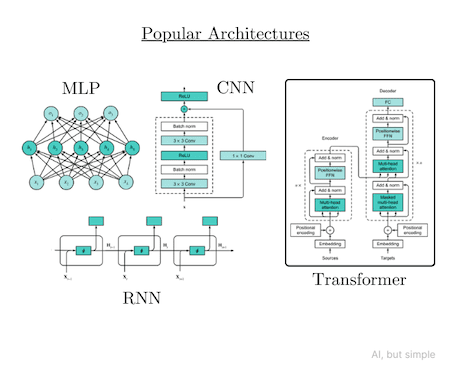
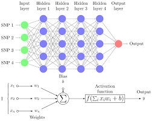
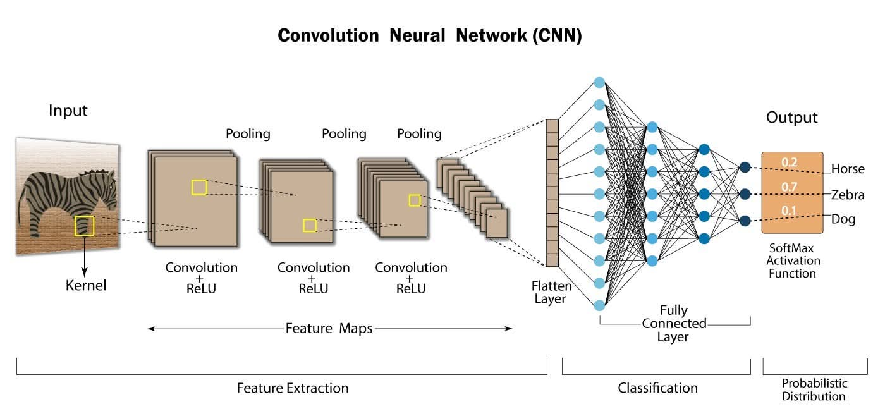
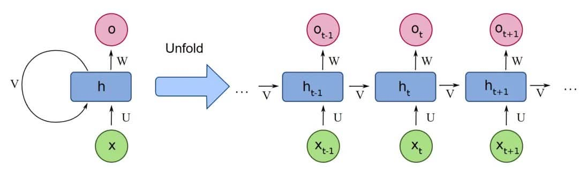
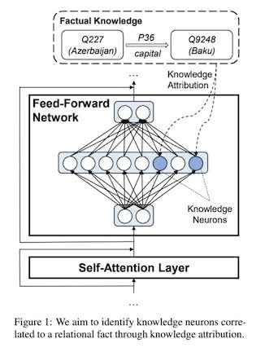

# MLP, CNN, RNN, and Transformer

**Answers to the Same Question**

---

## How do we make a machine understand a sentence?

A sentence is a **sequence** — order matters.

"Alice will eat pizza" means something very different from "Pizza will eat Alice."

---

Any model that processes language must answer:

> How do we capture the **meaning** and **relationships** between words in a sequence?

---

These are popular architecute:



---

1. MLP (Multi-Layer Perceptron) — the basic building block of all neural networks.
2. Convolutional Neural Networks (CNNs) — good for images, not ideal for sequences.
3. Recurrent Neural Networks (RNNs) — designed to handle sequences by maintaining a hidden state.
4. Transformers — use self-attention to capture relationships between all words at once.

---

<!-- _class: special -->

# 1. The Shared Foundation: Perceptrons

---

## Everything Starts Here: The Perceptron

Before either RNNs or Transformers, there is the **perceptron** — the basic building block of all neural networks.

$y = f\!\left(\sum_i w_i x_i + b\right)$

<style scoped>
table {
  font-size: 13pt !important;
}
table thead tr {
  background-color: #aad8e6;
}
</style>

| Symbol | Meaning                                  |
| ------ | ---------------------------------------- |
| $x_i$  | input values                             |
| $w_i$  | learned weights                          |
| $b$    | bias                                     |
| $f$    | activation function (e.g. ReLU, sigmoid) |

---

## From Perceptron to MLP

Stack multiple perceptrons into **layers** and you get a **Multi-Layer Perceptron (MLP)**:



---

Each layer learns increasingly abstract features.  
MLPs are excellent for fixed-size inputs — but **sentences vary in length**.

> Neither RNNs nor Transformers throw away the perceptron.  
> They both **use MLPs inside** — but add different mechanisms to handle sequences.

---

<!-- _class: special -->

# 2. CNN: Perceptrons with Local Receptive Fields

---

## The Core Idea of a CNN

A CNN (Convolutional Neural Network) applies the **same small perceptron** (called a filter or kernel) repeatedly across the input.



---

Instead of connecting every input to every neuron (like MLP), each neuron only looks at a **small local region** — its **receptive field**.

> Key insight: nearby pixels (or nearby words) are often more related than distant ones.

---

### From MLP to CNN — What Changes?

**MLP:** every input connects to every neuron

```txt
x₁ ─┐
x₂ ─┼──► [neuron]    every input, every neuron
x₃ ─┘
```

**CNN:** each neuron connects to only a small window

```txt
x₁ x₂ x₃
 └──┬──┘
 [filter]   only 3 inputs at a time
```

The same filter **slides** across the entire input — this is called **convolution**.

---

### The Convolution Operation

A filter is just a small set of weights. It slides across the input and produces one output number per position:

$
z_i = f\!\left(\sum_{k=0}^{K-1} w_k \cdot x_{i+k} + b\right)
$

<style scoped>
table {
  font-size: 13pt !important;
}
table thead tr {
  background-color: #aad8e6;
}
</style>

| Symbol    | Meaning                            |
| --------- | ---------------------------------- |
| $x_{i+k}$ | input values in the current window |
| $w_k$     | filter weights (learned)           |
| $K$       | filter size (e.g. 3×3 for images)  |
| $b$       | bias                               |
| $f$       | activation function (ReLU)         |

The same $w_k$ is used at **every position** — this is called **weight sharing across space**.

---

### CNN on an Image — Step by Step

For a 5×5 image with a 3×3 filter:

```txt
Image patch:     Filter (learned):   Output:
 1  2  3         0  1  0            one
 0  1  0    ×    1  0  1    =      number
 2  1  3         0  1  0
```

---

The filter slides across **every** 3×3 patch of the image:

```txt
┌───────────────┐
│ ■ ■ ■ · · · · │  filter here → z₁
│ ■ ■ ■ · · · · │
│ ■ ■ ■ · · · · │
│ · ■ ■ ■ · · · │  filter slides → z₂
│ · ■ ■ ■ · · · │
└───────────────┘
```

Each position produces one value — together they form a **feature map**.

---

### Multiple Filters = Multiple Features

One filter detects one kind of pattern. CNNs use **many filters in parallel**:

```txt
Input image
     │
     ├──► Filter 1 (detects edges)      → feature map 1
     ├──► Filter 2 (detects corners)    → feature map 2
     ├──► Filter 3 (detects textures)   → feature map 3
     └──► Filter N (detects curves)     → feature map N
```

In practice a single CNN layer might have **64, 128, or 512 filters** — each learning to detect a different visual pattern.

---

Stacking multiple layers builds increasingly **abstract features**:

- Layer 1: edges and colors
- Layer 2: shapes and textures
- Layer 3: object parts (eyes, wheels)
- Layer 4+: whole objects (face, car)

---

### Pooling: Reducing Size

After convolution, a **pooling** layer shrinks the feature map by summarizing local regions:

```txt
Max pooling (2×2):

 1  3  2  4          3  4
 5  6  1  2   ──►    6  3
 0  2  3  1
 4  1  0  2
```

---

Max pooling keeps the **strongest activation** in each region.

> Pooling makes the CNN **translation-invariant** — it recognizes a cat whether it is in the top-left or bottom-right of the image.

---

### CNN Strengths and Weaknesses

<style scoped>
table { font-size: 18pt !important; }
table thead tr { background-color: #aad8e6; }
</style>

| Strengths                                            | Weaknesses                                             |
| ---------------------------------------------------- | ------------------------------------------------------ |
| Excellent for **spatial data** (images, video)       | Needs large amounts of labeled image data              |
| **Weight sharing** drastically reduces parameters    | Poor at capturing **long-range** global relationships  |
| **Translation invariant** — position does not matter | Fixed receptive field — context window is limited      |
| Fast and parallelizable                              | Not naturally suited for sequences (text, time series) |

---

## CNN vs MLP — Key Difference

<style scoped>
table { font-size: 18pt !important; }
table thead tr { background-color: #aad8e6; }
</style>

|                       | MLP                                     | CNN                                           |
| --------------------- | --------------------------------------- | --------------------------------------------- |
| **Connectivity**      | Every input to every neuron             | Each neuron sees only a local window          |
| **Weight sharing**    | No — each connection has its own weight | Yes — same filter reused across all positions |
| **Good for**          | Fixed-size tabular data                 | Spatial data (images, grids)                  |
| **Parameters**        | Many (grows with input size)            | Few (filter size is fixed, small)             |
| **Spatial awareness** | None                                    | Built in via local receptive fields           |

---

**Example:** A 28×28 image (784 pixels) into a 512-neuron MLP needs **784 × 512 = 401,408** weights for one layer. A 3×3 CNN filter needs only **9** weights — reused 784 times.

---

<!-- _class: special -->

# 3. RNN: Perceptrons Chained Through Time

---

## The Core Idea of an RNN



An RNN processes a sentence **one word at a time**, left to right.

- At each step, the same perceptron layer runs — but it also receives a **hidden state** from the previous step.

---

$h_t = f(W_h \cdot h_{t-1} + W_x \cdot x_t + b)$

<style scoped>
table {
  font-size: 11pt !important;
}
table thead tr {
  background-color: #aad8e6;
}
</style>

| Symbol       | Meaning                                  |
| ------------ | ---------------------------------------- |
| $x_t$        | current word vector                      |
| $h_{t-1}$    | hidden state from previous step (memory) |
| $W_h$, $W_x$ | learned weight matrices                  |
| $h_t$        | new hidden state (updated memory)        |

The hidden state $h_t$ is the RNN's **"running memory"** of everything seen so far.

---

### RNN: Step by Step

For the sentence **"Alice will eat pizza"**:

```txt
x₁=Alice   x₂=will    x₃=eat     x₄=pizza
   │           │           │           │
   ▼           ▼           ▼           ▼
[MLP] ──h₁──► [MLP] ──h₂──► [MLP] ──h₃──► [MLP] ──h₄
```

- **h₁** contains: "I've seen Alice"
- **h₂** contains: "I've seen Alice, will"
- **h₃** contains: "I've seen Alice, will, eat"
- **h₄** contains: everything — but Alice's signal has faded

---

> Each step uses the **same weight matrices** — just applied again with the new hidden state.  
> The perceptron is reused at every time step.

---

### The Vanishing Gradient Problem

The further back a word is, the weaker its influence becomes on the final hidden state.

$$
h_4 \approx f(W_h \cdot \underbrace{f(W_h \cdot \underbrace{f(W_h \cdot h_1)}_{\text{fading...}})}_{\text{fading...}})
$$

By the time we reach "eat", the signal from "Alice" has passed through multiple nonlinear functions — it is **diluted**.

---

This is the **vanishing gradient problem**:  
gradients shrink as they travel back through time, making early words hard to learn from.

> **LSTM** (Long Short-Term Memory) was invented to address this — using gates to selectively remember or forget — but the fundamental sequential bottleneck remained.

---

### RNN: What the Perceptron Does

In an RNN, the perceptron (MLP) plays one role:

> **Given the current word and the accumulated memory, produce the next memory state.**

```txt
           ┌─────────────────┐
h_{t-1} ──►│                 │
           │   MLP (shared)  ├──► h_t
    x_t ──►│                 │
           └─────────────────┘
```

The same MLP weights are used at **every time step**.  
This is called **weight sharing across time**.

---

### RNN Strengths and Weaknesses

<style scoped>
table { font-size: 18pt !important; }
table thead tr { background-color: #aad8e6; }
</style>

| Strengths                                   | Weaknesses                                        |
| ------------------------------------------- | ------------------------------------------------- |
| Naturally handles variable-length sequences | Must process words **one at a time** — slow       |
| Small memory footprint                      | Long-range dependencies fade (vanishing gradient) |
| Conceptually simple                         | **Cannot be parallelized during training**        |
| Works well on short sequences               | Performance degrades on long sentences            |

---

<!-- _class: special -->

# 3. Transformer: Perceptrons Across Space

---

## The Core Idea of a Transformer

A Transformer processes **all words simultaneously**.

- Instead of passing a hidden state forward in time, it computes **relationships between all word pairs at once** using self-attention.

---

One Transformer layer has two components: Sefl-Attention and a Feed-Forward Network (FFN)

```txt
Input (all words at once)
        │
        ▼
  ┌──────────────┐
  │Self-Attention│  ← "Who should I pay attention to?"
  └──────┬───────┘
         │
         ▼
  ┌──────────────┐
  │     FFN      │  ← MLP applied per word (perceptrons!)
  └──────────────┘
         │
         ▼
Output (all words, enriched)
```

---

### Self-Attention: Computing Relationships

For every word, self-attention computes three vectors:

$$
Q = x W_Q \quad K = x W_K \quad V = x W_V
$$

---

### The Feed-Forward Network (FFN): Perceptrons Return

After attention has gathered relational information, each word's representation is passed through an **MLP independently**:



---

$$
\text{FFN}(x) = \text{ReLU}(x W_1 + b_1)\, W_2 + b_2
$$

This is a standard **2-layer perceptron** — applied identically to every word position.

---

> Attention answers: **"Which words matter to me?"**  
> FFN answers: **"What do I do with the information I gathered?"**

The FFN is where the Transformer stores and retrieves **factual knowledge** — researchers have found that facts like "Paris is the capital of France" live in the FFN weights.

---

### Transformer: Step by Step

For the sentence **"Alice will eat pizza"**:

```txt
Alice   will    eat    pizza
  │       │       │       │
  ▼       ▼       ▼       ▼
 ┌─────────────────────────┐
 │      Self-Attention     │   all words look at all words                    .
 └──┬──────┬──────┬──────┬─┘
    │      │      │      │
    ▼      ▼      ▼      ▼
  [FFN]  [FFN]  [FFN]  [FFN]   same MLP, applied per word
    │      │      │      │
    ▼      ▼      ▼      ▼
 Alice*  will*  eat*  pizza*    enriched representations
```

Every word is updated **in parallel** — no waiting.  
"eat\*" already knows about "Alice" after just one layer.

---

### Transformer Strengths and Weaknesses

<style scoped>
table { font-size: 18pt !important; }
table thead tr { background-color: #aad8e6; }
</style>

| Strengths                                           | Weaknesses                                             |
| --------------------------------------------------- | ------------------------------------------------------ |
| Processes all words **in parallel** — fast training | Attention cost grows as $O(n^2)$ with sequence length  |
| Captures long-range dependencies directly           | Needs **positional encoding** (no inherent word order) |
| Scales extremely well with data and compute         | **Much larger memory** footprint than RNNs             |
| Highly parallelizable on GPUs                       | Harder to interpret than RNNs                          |

---

## Why the Transformer Won

When "Attention Is All You Need" was published (2017), the community saw three key advantages:

1. **Parallelism** — RNNs could not use GPU hardware efficiently because each step depends on the previous one. Transformers process everything at once.

---

2. **Long-range dependencies** — A Transformer connects word 1 to word 500 with the same single attention operation. An RNN must pass a signal through 499 intermediate states.

3. **Scalability** — Transformer performance scales smoothly with more data, more parameters, and more compute — following the scaling laws that enabled GPT-3, GPT-4, and beyond.

---

> CNNs/RNNs were not wrong — they were the best solution available.  
> Transformers were simply **a better answer** to the same question.

---

<!-- _class: special -->

# 4. What They Share

---

## Similarities Run Deep

Despite looking very different on the surface, RNNs and Transformers share the same foundations:

<style scoped>
table { font-size: 10pt !important; }
table thead tr { background-color: #aad8e6; }
</style>

| Shared Concept           | How RNN Uses It                        | How Transformer Uses It                                   |
| ------------------------ | -------------------------------------- | --------------------------------------------------------- |
| **Perceptrons (MLP)**    | Main computation unit at each step     | FFN after attention in each layer                         |
| **Weight matrices**      | $W_h$, $W_x$ shared across time steps  | $W_Q$, $W_K$, $W_V$, $W_1$, $W_2$ shared across positions |
| **Learned embeddings**   | Word → vector before processing        | Word → vector before processing                           |
| **Backpropagation**      | Gradients flow backward through time   | Gradients flow backward through layers                    |
| **Activation functions** | ReLU, tanh in hidden layers            | ReLU in FFN layers                                        |
| **Loss function**        | Cross-entropy for next-word prediction | Cross-entropy for next-word prediction                    |

> Both are trained the same way: predict the next word, measure the error, adjust the weights.

---

### The Perceptron Never Left

A common misconception: "Transformers replaced perceptrons with attention."

**This is wrong.** Attention is not a perceptron — it has no activation function and no learned bias in the traditional sense. It is pure **weighted averaging**.

---

The perceptron (FFN) is still essential:

- Attention handles **relationships between words** (relational reasoning)
- FFN handles **transformation of each word's representation** (local processing)

Remove the FFN from a Transformer and performance drops significantly.  
The Transformer is **attention + perceptrons**, not **attention instead of perceptrons**.

---

## Evolution, Not Revolution

```txt
1943  Perceptron (McCulloch & Pitts)
       │
1980s  Multi-Layer Perceptron (MLP)
       │
1986   Backpropagation (Rumelhart et al.)
       │
1989   CNN — MLP + local filters + weight sharing (LeCun et al.)                                   .
       │
1990s  RNN — MLP + hidden state across time
       │
1997   LSTM — RNN + gating mechanism
       │
2012   AlexNet — CNN dominates image recognition (ImageNet)
       │
2014   Seq2Seq + Attention (Bahdanau et al.)
       │
2017   Transformer — Attention + MLP, no recurrence
       │
2018+  BERT, GPT, Claude, LLaMA...
```

Each step **built on** the previous one. The perceptron from 1943 is still inside GPT-4.
