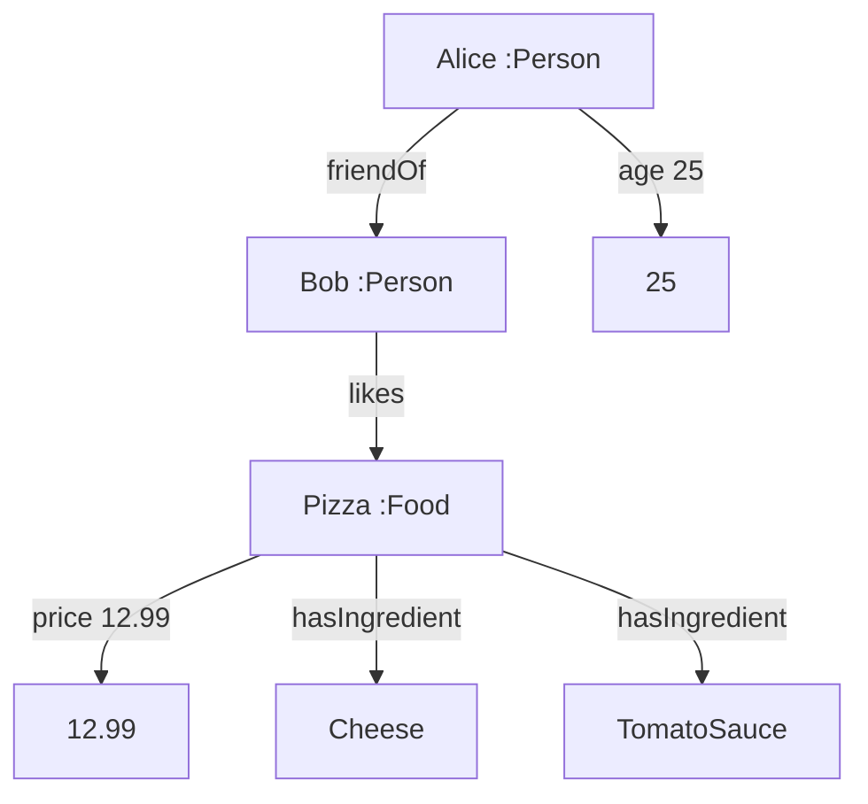
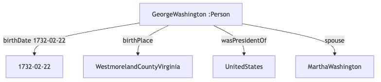
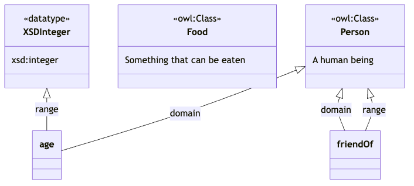

# The Three Layers of Knowledge Representation

**Semantic Web, Ontology, and Knowledge Graph**

---

## The Confusion

**Students often ask:**

- "What's the difference between ontology and knowledge graph?"
- "Isn't semantic web the same as ontology?"
- "When do I use which term?"

**Today:** Clear understanding of the three layers and how they relate

---

## The Big Picture: Three Layers

```txt
┌─────────────────────────────────┐
│     SEMANTIC WEB (Layer 3)      │  Vision & Standards
│  The Web of Data - Machine      │  (W3C, RDF, OWL, SPARQL)
│  Readable Internet              │
└───────────────┬─────────────────┘
                │
┌───────────────▼─────────────────┐
│      ONTOLOGY (Layer 2)         │  Schema & Rules
│  Domain Model - Classes,        │  (Structure, Constraints)
│  Properties, Rules              │
└───────────────┬─────────────────┘
                │
┌───────────────▼─────────────────┐
│   KNOWLEDGE GRAPH (Layer 1)     │  Data & Instances
│  Actual Facts - Specific        │  (Real Information)
│  Entities and Relationships     │
└─────────────────────────────────┘
```

---

## Analogy: Building a City

**Think of it like city infrastructure:**

1. **Knowledge Graph (Foundation)**
   - The actual buildings and roads
   - Specific addresses and locations
   - Real people living in real houses

Focuses on Data and Instances

---

2. **Ontology (Blueprint)**
   - Building codes and zoning laws
   - "What is a house?" "What is a road?"
   - Rules about how things connect

Focuses on Schema and Constraints

---

3. **Semantic Web (National Standards)**
   - Universal protocols for all cities
   - Standard ways to describe locations
   - How cities communicate with each other

Focus: Interoperability & Protocols

---

## Layer 1: Knowledge Graph (Data and Instances)

### What is it?

**A knowledge graph is the actual DATA:**

- Specific entities (Alice, Bob, Pizza)
- Concrete relationships (Alice likes Pizza)
- Real-world facts (Pizza costs $12)

**Think:** The INSTANCES, not the definitions

---

## Knowledge Graph Example

```txt
┌─────────┐
│  Alice  │
└────┬────┘
     │ friend_of
     ▼
┌─────────┐      likes       ┌─────────┐
│   Bob   │─────────────────>│  Pizza  │
└─────────┘                  └────┬────┘
                                  │ price
                                  ▼
                              "$12.99"
```

**This is concrete data about specific things**

---

## Knowledge Graph in RDF (Turtle)

Actual facts about specific entities

```turtle
:Alice rdf:type :Person .
:Alice :friendOf :Bob .
:Alice :age 25 .

:Bob rdf:type :Person .
:Bob :likes :Pizza .

:Pizza rdf:type :Food .
:Pizza :price 12.99 .
:Pizza :hasIngredient :Cheese .
:Pizza :hasIngredient :TomatoSauce .
```

**Each line is a FACT about a SPECIFIC thing**

---

### Drawing Relationship

We can use a tool, such as Mermaid, to visualize the knowledge graph relationships.

<style>
.columns {
  display: flex;
  gap: 2rem;  
  align-items: center;
}
.column.text {
  flex: 6;
}
.column.image {
  flex: 4;
}
</style>

<div class="columns">
  <div class="column image">


  </div>

  <div class="column text">



  </div>

</div>

---

## Knowledge Graph Characteristics

**✓ Specific entities** (not types)

- "Alice", "Bob", "This pizza"
- Not "Person in general" or "All pizzas"

You can think of it as: Objects in OOP
**✓ Concrete data**

- "Alice is 25 years old"
- "This pizza costs $12.99"

You can think of it as: Object methods or attributes in OOP

---

**✓ Individual relationships**

- "Alice knows Bob"
- "Bob likes pizza"

**✓ Can be queried**

- "Who are Alice's friends?"
- "What does Bob like?"

---

## Real-World Knowledge Graphs

**Google Knowledge Graph:**

```txt
:GeorgeWashington rdf:type :Person .
:GeorgeWashington :birthDate "1732-02-22" .
:GeorgeWashington :birthPlace :WestmorelandCountyVirginia .
:GeorgeWashington :wasPresidentOf :UnitedStates .
:GeorgeWashington :spouse :MarthaWashington .
```



**These are FACTS about a SPECIFIC person**

---

## Layer 2: Ontology (Schema and Constraints)

### What is it?

**An ontology is the SCHEMA (TPRC):**

- Defines what TYPES of things exist
- Defines what PROPERTIES they can have
- Defines RULES about relationships
- Provides CONSTRAINTS and validation

**Think:** The BLUEPRINT or STRUCTURE

---

- Remember CD in D? Conceptual Description in Domain
- In OOP, it's like a Class Definition
  - "What is a Person?" "What properties can a Person have?"
  - It also decribes the hierarchy of classes and relationships between them.

---

## Ontology Example

```turtle
# Ontology defines TYPES and RULES (not specific instances)

# What is a Person?
:Person rdf:type owl:Class .
:Person rdfs:comment "A human being" .
```

This ontology is written in turtle using OWL vocabulary.

- Instead of defining type or comment, we reuse existing one in rdf and rdfs namespaces.
- For example, we use owl:Class to define a class, rdfs:comment to add description, and rdf:type to specify the type of the class.

---

This is another class definition example: Food

```turtle
# What is a Food?
:Food rdf:type owl:Class .
:Food rdfs:comment "Something that can be eaten" .
```

We define the class Food (using owl schema), and we need properties that maps Food to data values.

---

```turtle
# What properties can a Person have?
:age rdf:type owl:DatatypeProperty ;
    rdfs:domain :Person ;
    rdfs:range xsd:integer ;
    rdfs:comment "Age must be a positive integer" .
```

Properties (DatatypeProperty or ObjectProperty) define relationships between classes and data values.

In this example, age property maps Person to integer values.

- rdfs:domain is the input class
- rdfs:range is the output datatype

You can think of properties as methods or attributes in OOP.

---

```turtle
:friendOf rdf:type owl:ObjectProperty ;
    rdfs:domain :Person ;
    rdfs:range :Person ;
    rdfs:comment "Friendship is between persons" .
```

---

## Overall Structure

We have two classes and two properties defined in this ontology.

- The properties define relationships between classes and data values.
- We use xsd:integer to specify that age is an integer datatype.



---

## Ontology Defines Structure

```txt
┌─────────────────────────────────┐
│         Person (Class)          │
│  Properties:                    │
│  - name: string                 │
│  - age: integer (>= 0)          │
│  - friendOf: Person             │
└─────────────────────────────────┘
              │
              │ subClassOf
              ▼
┌─────────────────────────────────┐
│        Student (Class)          │
│  Additional Properties:         │
│  - studentId: string            │
│  - major: string                │
└─────────────────────────────────┘
```

**Defines WHAT CAN EXIST, not what DOES EXIST**

---

## Ontology vs Knowledge Graph

| Aspect      | Ontology            | Knowledge Graph     |
| ----------- | ------------------- | ------------------- |
| **Level**   | Schema/Blueprint    | Data/Instances      |
| **Defines** | Types & Rules       | Specific Facts      |
| **Example** | "What is a Person?" | "Alice is a person" |
| **Purpose** | Structure           | Content             |
| **Changes** | Rarely              | Frequently          |
| **Size**    | Small (classes)     | Large (millions)    |

---

## Side-by-Side Comparison

**Ontology (Schema):**

```turtle
:Person rdf:type owl:Class .
:age rdfs:domain :Person ;
     rdfs:range xsd:integer .
```

_"A Person can have an age, which is an integer"_

**Knowledge Graph (Data):**

```turtle
:Alice rdf:type :Person .
:Alice :age 25 .
```

_"Alice is a person and she is 25 years old"_

---

## Think of it as Programming

**Ontology = Class Definition:**

```java
class Person {
    String name;
    int age;
    List<Person> friends;
}
```

**Knowledge Graph = Instances:**

```java
Person alice = new Person();
alice.name = "Alice";
alice.age = 25;

Person bob = new Person();
alice.friends.add(bob);
```

---

## Layer 3: Semantic Web (Interoperability & Protocols)

### What is it?

**The Semantic Web is the VISION and STANDARDS:**

- Web of linked data (not just documents)
- Machines can understand content
- Universal standards for representation
- Interoperability across systems

**Think:** The PROTOCOLS and INFRASTRUCTURE

---

## Semantic Web: The Big Vision

**Tim Berners-Lee's vision (2001):**

```txt
Traditional Web:
HTML pages → Humans read → Understand

Semantic Web:
RDF data → Machines read → Understand → Act
```

**Goal:** Make the web machine-understandable

---

## Semantic Web Stack

```txt
┌─────────────────────────────────┐
│  Trust & Proof                  │  Verify information
├─────────────────────────────────┤
│  Logic & Rules (SWRL, SHACL)    │  Reasoning
├─────────────────────────────────┤
│  Ontology (OWL)                 │  Define structure
├─────────────────────────────────┤
│  Query (SPARQL)                 │  Ask questions
├─────────────────────────────────┤
│  Schema (RDFS)                  │  Basic vocabulary
├─────────────────────────────────┤
│  Data (RDF)                     │  Facts as triples
├─────────────────────────────────┤
│  Syntax (XML, Turtle, JSON-LD)  │  How to write
├─────────────────────────────────┤
│  URI/IRI                        │  Unique identifiers
└─────────────────────────────────┘
```

---

## Semantic Web Technologies

**Standards provided by W3C:**

1. **RDF** (Resource Description Framework)
   - How to represent data as triples

2. **RDFS** (RDF Schema)
   - Basic vocabulary (class, subClass, property)

3. **OWL** (Web Ontology Language)
   - Rich ontology definitions

4. **SPARQL** (Query Language)
   - How to query RDF data

5. **SHACL** (Shapes Constraint Language)
   - How to validate data

---

### Triples

In RDF, data is stored as triples (also called triplets).

A triple has three parts: Subject — Predicate — Object

Think of it as a simple sentence:

Example: “Alice likes Pizza.”

This becomes an RDF triple:

- Subject → Alice (the thing we talk about)
- Predicate → likes (the relationship)
- Object → Pizza (the value or other thing)

---

### Why Triple Format Is Useful

1. Triples make data:

- Easy for machines to understand
- Easy to connect (link data from different sources)
- Flexible (you can add new facts without changing structure)

2. You can remember RDF triples like this:

- Thing → Relationship → Value
- Who → Does what → To whom/what

---

## Semantic Web: Universal Standards

**Why standards matter:**

**Without standards:**

```txt
Company A: uses "firstName"
Company B: uses "given_name"
Company C: uses "name_first"

→ Hard to integrate!
```

**With Semantic Web standards:**

```txt
Everyone uses: foaf:firstName
(Friend of a Friend vocabulary)

→ Easy to integrate!
```

---

## Semantic Web Enables Integration

```txt
┌──────────────┐     ┌──────────────┐     ┌──────────────┐
│  Hospital A  │     │  Hospital B  │     │  Hospital C  │
│  (RDF data)  │     │  (RDF data)  │     │  (RDF data)  │
└──────┬───────┘     └──────┬───────┘     └──────┬───────┘
       │                    │                    │
       └────────────────────┼────────────────────┘
                            │
                  ┌─────────▼──────────┐
                  │  Shared Ontology   │
                  │  (SNOMED CT)       │
                  └────────────────────┘
                            │
                  ┌─────────▼──────────┐
                  │  Integrated View   │
                  │  (SPARQL Query)    │
                  └────────────────────┘
```

---

## Putting It All Together

**Example: Medical Domain**

**Layer 3: Semantic Web (Standards)**

```txt
W3C says: Use RDF for data, OWL for ontology, SPARQL for queries
```

**Layer 2: Ontology (Schema)**

```turtle
:Patient rdf:type owl:Class .
:hasDiagnosis rdfs:domain :Patient ;
              rdfs:range :Disease .
```

**Layer 1: Knowledge Graph (Data)**

```turtle
:JohnDoe rdf:type :Patient .
:JohnDoe :hasDiagnosis :Diabetes .
:JohnDoe :prescribedMedication :Insulin .
```

---

## Another Example: E-commerce

**Layer 3: Semantic Web**

- Use schema.org vocabulary
- Use RDF for product descriptions
- Enable cross-site comparison

**Layer 2: Ontology**

```turtle
:Product rdf:type owl:Class .
:hasPrice rdfs:domain :Product ; rdfs:range xsd:decimal .
```

**Layer 1: Knowledge Graph**

```turtle
:iPhone15Pro rdf:type :Product .
:iPhone15Pro :hasPrice 999.99 .
:iPhone15Pro :manufacturer :Apple .
```

---

## Relationship Between Layers

```txt
Semantic Web
    ↓ provides standards for
Ontology
    ↓ defines structure for
Knowledge Graph

Knowledge Graph
    ↑ conforms to
Ontology
    ↑ uses standards from
Semantic Web
```

**Bottom-up:** Data uses structure uses standards
**Top-down:** Standards define structure define data

---

## Practical Perspective

**When building a system:**

1. **Choose Semantic Web standards** (decide on technologies)
   - "We'll use RDF and SPARQL"

2. **Create/use Ontology** (define your domain)
   - "We need Person, Product, Order classes"

3. **Populate Knowledge Graph** (add real data)
   - "Alice bought Product #123 on 2024-01-15"

**Bottom-up in practice, top-down in design**

---

## Common Confusion 1

**"Is knowledge graph part of ontology?"**

❌ No!

- Ontology = Schema (the rules)
- Knowledge graph = Data (the facts)

**Analogy:**

- Ontology = Database schema
- Knowledge graph = Database records

---

## Common Confusion 2

**"Is ontology the same as semantic web?"**

❌ No!

- Semantic web = Vision + Standards
- Ontology = One technology within semantic web

**Analogy:**

- Semantic web = The Internet (infrastructure)
- Ontology = HTTP (one protocol)

---

## Common Confusion 3

**"Can I have knowledge graph without ontology?"**

✓ Technically yes, but not recommended!

**Without ontology:**

```turtle
:Alice :foo :Bob .
:Bob :bar 25 .
```

_What does this mean? No structure!_

**With ontology:**

```turtle
:Alice :friendOf :Bob .
:Bob :age 25 .
```

_Structure gives meaning!_

---

**With Ontology + Explicit Types (Best Practice)**

```turtle
:Alice rdf:type :Person .
:Bob rdf:type :Person .

:Alice :friendOf :Bob .
:Bob :age "25"^^xsd:integer .
```

We use 'a' as shorthand for 'rdf:type' to explicitly state the types of Alice and Bob.

```turtle
:Bob a :Person ;
     :age "25"^^xsd:integer .
```

---

**Complete Example**

```turtle
@prefix :    <http://example.org/> .
@prefix rdf: <http://www.w3.org/1999/02/22-rdf-syntax-ns#> .
@prefix rdfs:<http://www.w3.org/2000/01/rdf-schema#> .
@prefix xsd: <http://www.w3.org/2001/XMLSchema#> .

### Class
:Person a rdfs:Class .

### Properties (ontology part)
:friendOf a rdf:Property ;
  rdfs:domain :Person ;
  rdfs:range  :Person .

:age a rdf:Property ;
  rdfs:domain :Person ;
  rdfs:range  xsd:integer .

### Data (facts)
:Alice a :Person ;
  :friendOf :Bob .

:Bob a :Person ;
  :age "25"^^xsd:integer .
```

---

## Real-World Examples

**Google Knowledge Graph:**

- Built on Semantic Web principles
- Uses extensively ontology (schema.org)
- Contains billions of facts (knowledge graph)

---

**Wikidata:**

- Uses semantic web standards (RDF, URIs, and SPARRQL)
- Has Wikidata ontology
- Contains millions of entities

**Facebook Social Graph:**

- Uses semantic web principles
- Has social ontology (Person, Post, Like)
- Contains user data

---

## Different Perspectives

**From a researcher's view:**

- Semantic Web = Research area
- Ontology = Formal representation
- Knowledge Graph = Application

**From a developer's view:**

- Semantic Web = Technology stack
- Ontology = Schema definition
- Knowledge Graph = Database

**From a business view:**

- Semantic Web = Standards compliance
- Ontology = Domain model
- Knowledge Graph = Data asset

---

## When Do You Use Which Term?

**"We're building a knowledge graph"**
→ Talking about storing and querying data

**"We're designing an ontology"**
→ Talking about modeling domain concepts

**"We're using semantic web technologies"**
→ Talking about RDF, OWL, SPARQL, etc.

**"We're creating a semantic web application"**
→ Talking about linked open data

---

## Size Comparison

**Typical sizes:**

**Ontology:**

- 10-1000 classes
- 50-5000 properties
- Dozens of rules
- KB in size

**Knowledge Graph:**

- Millions of entities
- Billions of relationships
- TB-PB in size

**Semantic Web:**

- Standards (small documents)
- Implementations (various sizes)

---

## Evolution Speed

```txt
Semantic Web Standards:
├─ RDF (1999) → Still used
├─ OWL (2004) → Still used
└─ SPARQL (2008) → Still used
    (Evolve slowly, stable)

Ontology:
├─ Version 1.0 (2020)
├─ Version 1.1 (2021) → Added classes
├─ Version 1.2 (2022) → Modified rules
└─ Version 2.0 (2023) → Major revision
    (Evolve with domain changes)

Knowledge Graph:
├─ 2024-01-01: 1M entities
├─ 2024-02-01: 1.2M entities
├─ 2024-03-01: 1.5M entities
└─ 2024-04-01: 2M entities
    (Grows continuously)
```

---

## Dependency Direction

```txt
Semantic Web (Independent)
    ↓ used by
Ontology (Depends on Semantic Web)
    ↓ defines
Knowledge Graph (Depends on Ontology)
```

**You can't have knowledge graph without ontology**
**You can't have ontology without semantic web standards**
_Well, technically you can, but it defeats the purpose!_

---

## Practical Decision Guide

**Question: "What am I working on?"**

**Adding new facts?**
→ Working on Knowledge Graph

**Defining new concepts?**
→ Working on Ontology

**Choosing technologies?**
→ Working with Semantic Web standards

**Connecting different systems?**
→ Using Semantic Web principles

---

## Summary Table

| Layer               | What      | Example      | Purpose          | Size           |
| ------------------- | --------- | ------------ | ---------------- | -------------- |
| **Semantic Web**    | Standards | RDF, OWL     | Interoperability | Standards docs |
| **Ontology**        | Schema    | Person, Food | Structure        | 100s classes   |
| **Knowledge Graph** | Data      | Alice, Pizza | Facts            | Millions       |

Semantic Web (Independent)
↓ used by
Ontology (Depends on Semantic Web)
↓ defines
Knowledge Graph (Depends on Ontology)

````

**You can't have knowledge graph without ontology**
**You can't have ontology without semantic web standards**
*Well, technically you can, but it defeats the purpose!*

---

## Practical Decision Guide

**Question: "What am I working on?"**

**Adding new facts?**
→ Working on Knowledge Graph

**Defining new concepts?**
→ Working on Ontology

**Choosing technologies?**
→ Working with Semantic Web standards

**Connecting different systems?**
→ Using Semantic Web principles

---

## Summary Table

| Layer | What | Example | Purpose | Size |
|-------|------|---------|---------|------|
| **Semantic Web** | Standards | RDF, OWL | Interoperability | Standards docs |
| **Ontology** | Schema | Person, Food | Structure | 100s classes |
| **Knowledge Graph** | Data | Alice, Pizza | Facts | Millions |

---

## Visual Summary

```txt
┌─────────────────────────────────────────┐
│        SEMANTIC WEB                     │
│  "How should we represent knowledge?"   │
│  → RDF, OWL, SPARQL, SHACL             │
└──────────────┬──────────────────────────┘
               │ provides standards
┌──────────────▼──────────────────────────┐
│           ONTOLOGY                      │
│  "What exists in this domain?"          │
│  → Classes, Properties, Rules           │
└──────────────┬──────────────────────────┘
               │ defines structure
┌──────────────▼──────────────────────────┐
│        KNOWLEDGE GRAPH                  │
│  "What are the actual facts?"           │
│  → Entities, Relationships              │
└─────────────────────────────────────────┘
````

---

## Key Takeaways

✓ **Three distinct layers with clear purposes**
✓ **Semantic Web = Standards and vision**
✓ **Ontology = Schema and rules**
✓ **Knowledge Graph = Data and facts**
✓ **They work together, not separately**
✓ **Each layer depends on the one above**

**Understanding the layers helps you talk about and build better systems!**

---

## Common Mistakes to Avoid

❌ "Let's build an ontology" (when you mean knowledge graph)
✓ "Let's populate our knowledge graph"

❌ "Our semantic web contains customer data"
✓ "Our knowledge graph contains customer data"

❌ "The ontology has 1 million products"
✓ "The knowledge graph has 1 million products"

❌ "We're designing the knowledge graph"
✓ "We're designing the ontology"

---

## Questions to Test Understanding

**Q1:** "We added 10,000 new customers to the system"
→ Which layer? **Knowledge Graph**

**Q2:** "We defined what a Customer is"
→ Which layer? **Ontology**

**Q3:** "We decided to use RDF instead of JSON"
→ Which layer? **Semantic Web**

**Q4:** "Two companies want to share data"
→ Which layer helps? **Semantic Web (standards)**

---

## Next Steps

**In upcoming lectures:**

1. Deep dive into RDF and triples (Semantic Web layer)
2. Building ontologies with Protégé (Ontology layer)
3. Creating and querying knowledge graphs (KG layer)
4. Integration patterns (using all three)

**Now you have the foundation to understand where each piece fits!**
